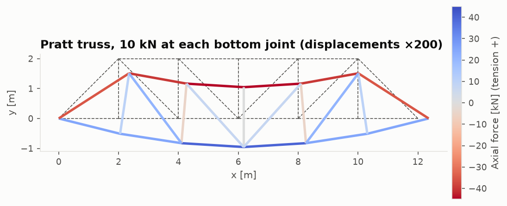

# Aircraft Structures From Scratch

[](https://github.com/GMCavalheri/aircraft-structures-from-scratch/actions/workflows/ci.yml)

Aerospace structural analysis implemented from first principles in Python and NumPy:
- stress transformation and yield
- Euler–Bernoulli beams and thin-walled torsion
- a hand-built finite element solver
- column, plate and FEA eigenvalue buckling
- Classical Lamination Theory with ply-by-ply failure
- S-N fatigue with rainflow counting and Miner's rule

No FEA or composite libraries are used. Every module is validated against closed-form
solutions, published worked examples, or MIL-HDBK-5J / MIL-HDBK-17 data.

<p align="center">
  
  
  
  
</p>

## What's inside

| Module | Method | Validated against |
|---|---|---|
| [`stress_strain`](src/structures/stress_strain) | Tensor transformation, principal stresses, Mohr's circle, von Mises / Tresca, Hooke's law | closed forms, tensor invariants |
| [`beam_theory`](src/structures/beam_theory) | Macaulay solver (determinate and indeterminate in one linear system), section properties, Bredt–Batho torsion | 9 closed-form beam cases, exact thin-tube J |
| [`fea_solver`](src/structures/fea_solver) | 2D bar + Euler–Bernoulli frame elements, sparse assembly, consistent loads | truss hand solutions, beam closed forms, convergence orders 2 and 4 |
| [`buckling`](src/structures/buckling) | Euler, Johnson, tangent-modulus columns; plate buckling; FEA eigen-buckling | Euler loads to 3e-5, exact mode shapes, plate k = 4 |
| [`composite_laminates`](src/structures/composite_laminates) | CLT (ABD), ply stresses, max stress/strain, Tsai–Hill, Tsai–Wu, ply-by-ply failure | Kaw's worked examples to 4 significant figures |
| [`fatigue`](src/structures/fatigue) | Basquin and MIL-HDBK-5J S-N, mean-stress corrections, ASTM E1049 rainflow, Miner | ASTM E1049 example (exact), handbook equations |
| [`materials`](src/structures/materials) | Cited allowables and ply data | MIL-HDBK-5J, MIL-HDBK-17-2F, Kaw |

## Headline results

| Benchmark | Computed | Reference |
|---|---|---|
| Propped cantilever, uniform load: prop reaction | 3wL/8, to round-off | closed form |
| FEA beam nodal deflections, consistent loads | exact on every mesh | Tong's theorem |
| FEA buckling, fixed–pinned column, 16 elements | +8.6e-6 | π²EI/(0.6992 L)² |
| Kaw [0/90/0] laminate: Ex, Ey, νxy | 124.5 GPa, 67.43 GPa, 0.04292 | same (Kaw) |
| Kaw [0/90/0] ply-by-ply failure | 7.277 MN/m, then 15.0 MN/m | same (Kaw) |
| Kaw 60° lamina, Tsai–Wu | 22.39 MPa | 22.39 MPa (Kaw) |
| ASTM E1049 rainflow example | identical cycle list | ASTM E1049 |
| 2024-T3 Kt = 2 under a synthetic flight spectrum | 2.1 × 10⁵ flights (median) | MIL-HDBK-5J S-N curve |

Full comparison, figures and a discussion of every discrepancy:
**[validation report](docs/validation-report.md)**.

## Quickstart

Requires [uv](https://docs.astral.sh/uv/).

```bash
uv sync
uv run pytest
```

```python
from structures.buckling import column_model, euler_load, linear_buckling
from structures.composite_laminates import Laminate
from structures.fatigue import count_cycles, flight_history, handbook_curve, miner_damage
from structures.fea_solver import beam_model
from structures.materials import KSI, isotropic, ply

al = isotropic("2024-T3")  # MIL-HDBK-5J B-basis allowables, SI units

m = beam_model(2.0, 8, al.E, 4e-4, 8e-6)  # cantilever, 8 frame elements
m.fix(0).load(8, fy=-5e3)
print(f"tip deflection = {m.solve().displacement(8)[1] * 1e3:.2f} mm")  # -23.02 = -PL^3/3EI

col = column_model(1.2, 8, al.Ec, 3e-4, 1e-8, end="fixed-pinned")
P = linear_buckling(col).load_factors[0]
print(f"P_cr = {P:.0f} N (Euler {euler_load(al.Ec, 1e-8, 1.2, 'fixed-pinned'):.0f} N)")

lam = Laminate.from_angles(ply("T300/976"), [0, 45, -45, 90], 0.135e-3, symmetric=True)
Nx, failed = lam.first_ply_failure(N=(1, 0, 0), criterion="tsai_wu")
print(f"first-ply failure at Nx = {Nx / 1e3:.0f} kN/m (plies {failed})")  # the 90° plies

hist = flight_history(500, s_1g=12 * KSI, s_ground=-4 * KSI, beta=2.5 * KSI, seed=11)
D = miner_damage(count_cycles(hist), handbook_curve("2024-T3_Kt2").life_from_amplitude)
print(f"fatigue life = {500 / D:,.0f} flights")  # 210,691
```

Regenerate every figure and results table:

```bash
uv run python validation/run_all.py
```

Regenerate and execute the notebooks:

```bash
uv run python notebooks/build_notebooks.py
```

## Repository layout

```
src/structures/      one subpackage per discipline + materials data and shared plotting
tests/               pytest suite: closed-form, worked-example and handbook checks
validation/          validation scripts, cited reference data, generated results tables
notebooks/           executed walkthroughs, one per phase (generated by build_notebooks.py)
docs/                theory notes, validation report, figures, lessons/ (the course)
```

## Course

A seven-lesson course walks through every method like a lecture, with derivations, worked
examples, figures, pitfalls and exercises: **[start here](docs/lessons/README.md)**.

1. [Stress and strain](docs/lessons/01-stress-and-strain.md)
2. [Beams and torsion](docs/lessons/02-beams-and-torsion.md)
3. [The finite element method](docs/lessons/03-finite-element-method.md)
4. [Buckling](docs/lessons/04-buckling.md)
5. [Composite laminates](docs/lessons/05-composite-laminates.md)
6. [Fatigue](docs/lessons/06-fatigue.md)
7. [Verification and validation](docs/lessons/07-verification-and-validation.md)

## Theory notes

1. [Stress and strain](docs/stress_strain.md)
2. [Beam theory and torsion](docs/beam_theory.md)
3. [The finite element solver](docs/fea_solver.md)
4. [Buckling](docs/buckling.md)
5. [Composite laminates](docs/composite_laminates.md)
6. [Fatigue](docs/fatigue.md)

## Data sources

All free and public:
- **MIL-HDBK-5J** (2003, Distribution A): design allowables, Ramberg–Osgood exponents, S-N
  equations.
- **MIL-HDBK-17-2F** (2002, Distribution A): composite ply properties.
- **Kaw, *Mechanics of Composite Materials***: worked examples, via the author's open
  courseware.
- **ASTM E1049**: the rainflow example.

MMPDS (the paid successor to MIL-HDBK-5) is deliberately not used. Values may have been
revised since 2003: fine for learning, not for certification work.

## Conventions

SI units internally (N, m, Pa), angles in radians, tension positive, Voigt order with
engineering shear strain. Beams: x along the span, loads and deflection positive up, sagging
moment positive. See [CLAUDE.md](CLAUDE.md) for contributor conventions.

## Scope and limits

Everything is linear elastic and small-displacement. The exceptions are the tangent-modulus
column and the full ply discount in progressive laminate failure. Out of scope: shear
deformation, plates/shells in FEA, post-buckling, interlaminar stresses, crack growth, and
scatter factors. See each theory note's "Limits" section.

Planned extensions: 2D plate/shell elements and probabilistic fatigue with load scatter.

## License

[MIT](LICENSE)
