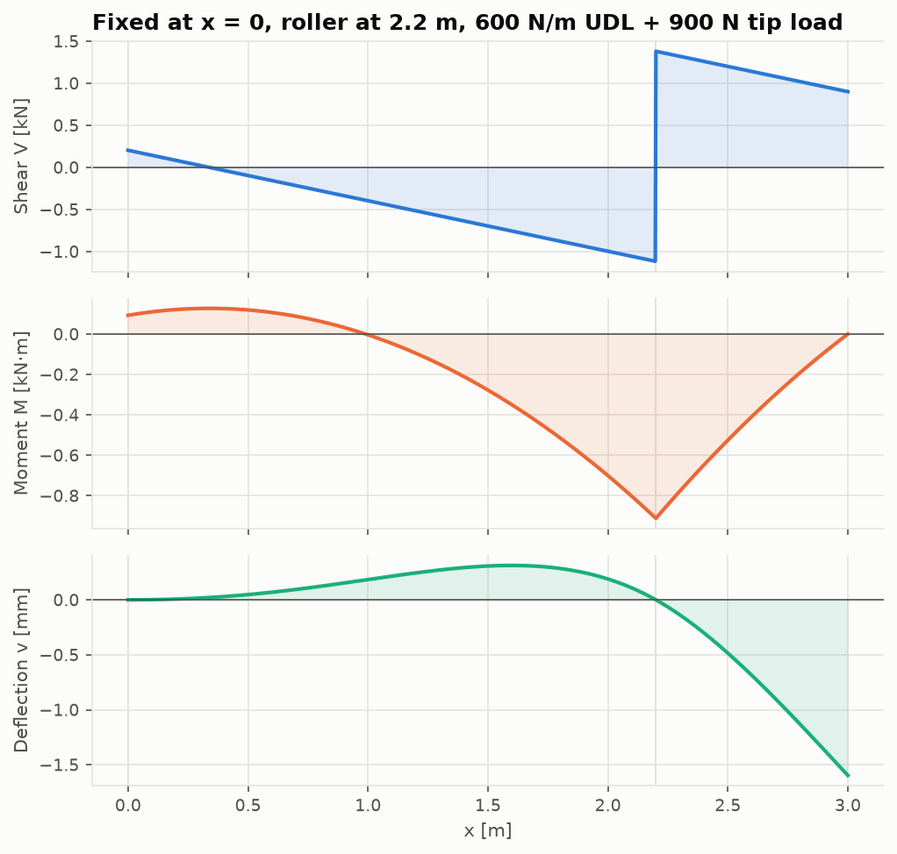

# Beam theory and torsion

Code: [`src/structures/beam_theory/`](../src/structures/beam_theory) ·
Notebook: [`02_beam_theory.ipynb`](../notebooks/02_beam_theory.ipynb)

## Euler–Bernoulli bending

Plane sections remain plane and normal to the deformed axis. With x along the beam, the
deflection v and the loads positive up, and sagging moment positive:

```math
\frac{dV}{dx} = q, \qquad \frac{dM}{dx} = V, \qquad EI\,\frac{d^2v}{dx^2} = M, \qquad \sigma_x = -\frac{M y}{I}
```

so a sagging moment compresses the top fibre (y > 0).

## Macaulay's method as a linear system

Every load is written as a singularity function $\langle x-a\rangle^n$, which is
$(x-a)^n$ for $x \ge a$ and 0 otherwise:

| Load at a | Contribution to M(x) |
|---|---|
| Point force P (up) | $P\langle x-a\rangle^1$ |
| Couple $M_0$ (counter-clockwise) | $-M_0\langle x-a\rangle^0$ |
| Linear distributed load from a to b | $w_1\langle x-a\rangle^2/2 + s\langle x-a\rangle^3/6$, minus the same terms from b with $w_2$ |

Integrating twice gives $EIv = \iint M\,dx\,dx + C_1x + C_2$. The `Beam` solver treats each support
reaction as a point force (plus a couple at fixed supports) of unknown size. These and
$C_1, C_2$ come from one square linear system:

```math
v(x_s) = 0 \;\;\text{(every support)}, \qquad v'(x_f) = 0 \;\;\text{(fixed supports)}, \qquad V(L^+) = 0, \qquad M(L^+) = 0
```

The last two rows are overall force and moment equilibrium. So the same code solves a
simply supported beam (2 unknown reactions + 2 constants = 4 equations), a propped cantilever
or a three-support continuous beam, with no separate compatibility step. A beam with too few
supports makes the matrix rank-deficient and raises an error.



## Section properties

`rectangle`, `circle`, `tube` and `i_section` return exact properties. `thin_walled(segments)`
builds any section from straight thin walls `((z1, y1), (z2, y2), t)` and computes the area,
centroid, $I$, $I_{lateral}$, the product of inertia and the torsion constant. The open-section
torsion constant is $\sum l t^3/3$; for `closed=True`, Bredt–Batho gives
$4A_{enc}^2/\oint ds/t$. The tests check that it reproduces the exact I-section and the
product of inertia of an angle.

## Torsion

| Section | Shear stress | Twist rate |
|---|---|---|
| Circular shaft | $\tau = Tr/J$, $J = \pi(d_o^4-d_i^4)/32$ | $T/GJ$ |
| Closed thin-walled cell (Bredt–Batho) | $q = T/2A_{enc}$, $\tau = q/t$ | $\dfrac{T}{4A_{enc}^2G}\oint\dfrac{ds}{t}$ |
| Open thin-walled section | $\tau_{max} = Tt_{max}/J$, $J = \sum bt^3/3$ | $T/GJ$ |

Slitting a thin tube of radius r and thickness t lowers its torsional stiffness by
$3r^2/t^2$, which is 7500 for r = 50 mm and t = 1 mm. This is why wing boxes and fuselages are
closed cells (Megson, *Aircraft Structures for Engineering Students*, Ch. 18).

## Validation

Nine standard cases match their closed forms to machine precision: cantilever, simply
supported and fixed–fixed beams under point, uniform, triangular and couple loads, the propped
cantilever, and the two-span continuous beam. The rounded textbook coefficients (wL⁴/185EI,
0.00652 w₀L⁴/EI) are replaced by their exact expressions in
[`closed_form.py`](../src/structures/beam_theory/closed_form.py). Results:
[`validation/results/beam_theory.md`](../validation/results/beam_theory.md).

## Limits

Prismatic beams (constant EI), small deflections, no shear deformation (Timoshenko beams), no
axial–bending interaction. Shear flow and shear centres of open sections are not
implemented. Variable stiffness and frames are handled by the [FEA solver](fea_solver.md).
