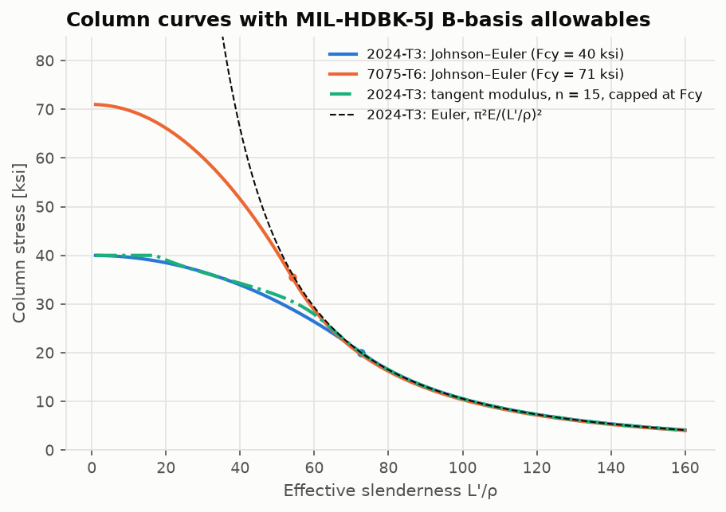
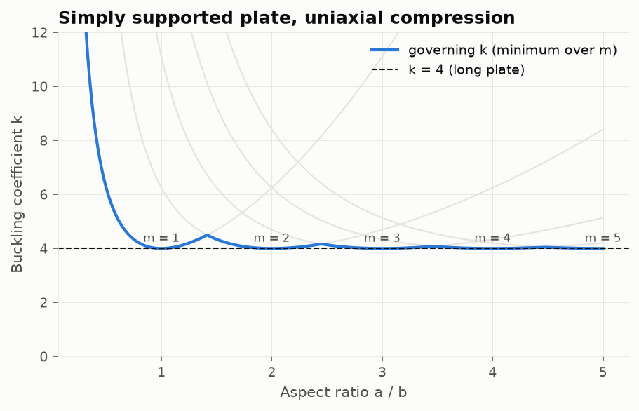

# Buckling

Code: [`src/structures/buckling/`](../src/structures/buckling) ·
Notebook: [`04_buckling.ipynb`](../notebooks/04_buckling.ipynb)

## Euler columns

A perfectly straight, centrally loaded elastic column has a non-trivial equilibrium shape
when $EIv'''' + Pv'' = 0$ admits a solution that satisfies the end conditions. The lowest
such load is

```math
P_{cr} = \frac{\pi^2 EI}{(KL)^2}, \qquad F_c = \frac{\pi^2 E}{(L'/\rho)^2}, \quad L' = KL, \ \rho = \sqrt{I/A}
```

(MIL-HDBK-5J Eq. 1.3.8(b)).

| End conditions | K | Mode shape on 0 ≤ ξ ≤ 1 |
|---|---|---|
| pinned–pinned | 1 | $\sin\pi\xi$ |
| fixed–free | 2 | $1-\cos(\pi\xi/2)$ |
| fixed–fixed | 0.5 | $(1-\cos 2\pi\xi)/2$ |
| fixed–pinned | 0.6992 | $\sin k\xi - k\xi + k(1-\cos k\xi)$, with $\tan k = k$, k = 4.4934 |

The fixed–pinned factor is $\pi/4.4934$: write $v = A\sin kx + B\cos kx + Cx + D$, apply
$v(0) = v'(0) = v(L) = v''(L) = 0$, and the determinant vanishes when $\tan kL = kL$.

## Inelastic columns

Stocky columns yield before they buckle elastically. Two classical models:

**Johnson parabola** (Bruhn; Megson Ch. 8), tangent to Euler at $F_c = F_{cy}/2$:

```math
F_c = F_{cy} - \frac{F_{cy}^2}{4\pi^2E}\left(\frac{L'}{\rho}\right)^2, \qquad \frac{L'}{\rho} < \pi\sqrt{\frac{2E}{F_{cy}}}
```

**Tangent modulus** (Engesser; MIL-HDBK-5J Eq. 1.3.8(a)): $F_c = \pi^2 E_t(F_c)/(L'/\rho)^2$.
$E_t$ comes from the Ramberg–Osgood curve $\varepsilon = f/E + 0.002(f/F_{0.2})^n$
(MIL-HDBK-5J Eq. 1.3.9):

```math
\frac{1}{E_t} = \frac1E + \frac{0.002\,n\,f^{n-1}}{F_{0.2}^n}
```

The implicit equation is solved with Brent's method. MIL-HDBK-5J Fig. 3.2.3.1.6(a) gives
n = 15 for 2024-T3 sheet in longitudinal compression. Column stress is capped at the
compressive strength (MIL-HDBK-5J Sec. 1.6.2.2).



## Plate buckling

A flat skin panel of width b and thickness t buckles at

```math
\sigma_{cr} = k\,\frac{\pi^2E}{12(1-\nu^2)}\left(\frac tb\right)^2
```

For all edges simply supported and uniaxial compression, m half-waves along the length a
give $k = (mb/a + a/mb)^2$. The governing k is the minimum over m. It equals 4 whenever
a/b is an integer, peaks at 4.5 at a/b = √2 where m = 1 and m = 2 cross, and tends to 4 for
long plates. Shear buckling uses $k_s = 5.35 + 4(b/a)^2$ (Timoshenko & Gere, *Theory of
Elastic Stability*, Ch. 9).



## FEA eigenvalue buckling

The frame element's consistent geometric stiffness under axial force N (tension positive) is

```math
\mathbf k_G = \frac{N}{30L}\begin{bmatrix} 36 & 3L & -36 & 3L \\ 3L & 4L^2 & -3L & -L^2 \\ -36 & -3L & 36 & -3L \\ 3L & -L^2 & -3L & 4L^2 \end{bmatrix}
```

`linear_buckling(model)` takes four steps:
1. Solve the static problem under a reference load.
2. Read each element's axial force.
3. Assemble $\mathbf K_G$.
4. Solve $(\mathbf K + \lambda\mathbf K_G)\boldsymbol\phi = 0$ for the load factors λ.

It is solved as the symmetric-definite problem $-\mathbf K_G\boldsymbol\phi = \mu\mathbf K\boldsymbol\phi$
with $\lambda = 1/\mu$, since $\mathbf K$ is positive definite once supports are applied.

With consistent $\mathbf K_G$ the FEA load is an upper bound, and its error falls as $h^4$. The
nodal deflections of the trigonometric modes are exact on uniform meshes.


## Validation

| Check | Result |
|---|---|
| FEA vs Euler, all four end conditions, 16 elements | ≤ 3.3e-5 |
| Convergence order of the FEA load | 4.0 |
| Higher modes, pinned–pinned | $P_n/P_1 = n^2$ to 1e-3 (40 elements) |
| Mode shapes | exact (trigonometric modes), 3e-7 (fixed–pinned, 8 elements) |
| Johnson–Euler tangency at $F_{cy}/2$ | value and slope |
| Plate k at a/b = 1, 2, 3 and √2 | 4, 4, 4 and 4.5 |

Tables: [`validation/results/buckling.md`](../validation/results/buckling.md).

## Limits

Linear (bifurcation) buckling of perfect structures. There is no imperfection sensitivity,
post-buckling (skin panels carry load well past initial buckling, as in tension-field and
effective-width methods), torsional or flexural–torsional buckling, or local crippling.
