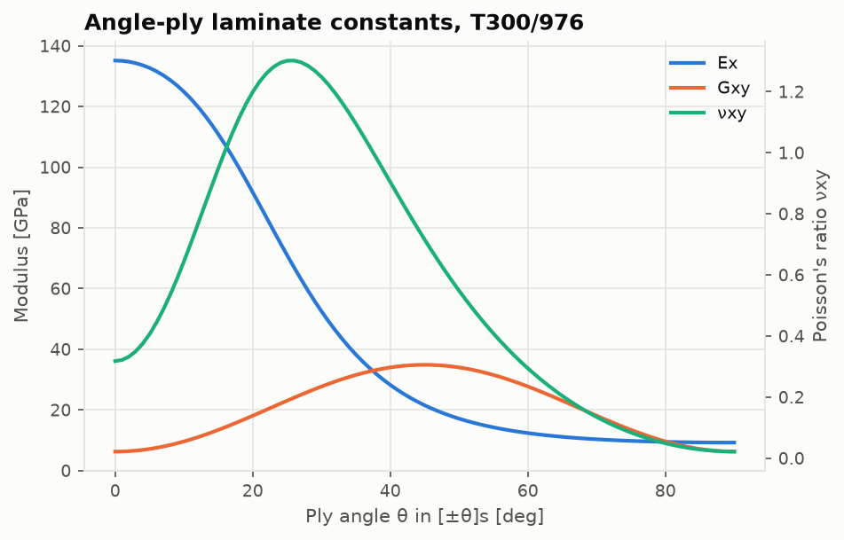

# Composite laminates: Classical Lamination Theory

Code: [`src/structures/composite_laminates/`](../src/structures/composite_laminates) ·
Notebook: [`05_composite_laminates.ipynb`](../notebooks/05_composite_laminates.ipynb)

## The lamina

A unidirectional ply in plane stress, in its material axes (1 = fibre, 2 = transverse), has

```math
\begin{bmatrix}\sigma_1\\\sigma_2\\\tau_{12}\end{bmatrix} =
\begin{bmatrix} Q_{11} & Q_{12} & 0 \\ Q_{12} & Q_{22} & 0 \\ 0 & 0 & Q_{66}\end{bmatrix}
\begin{bmatrix}\varepsilon_1\\\varepsilon_2\\\gamma_{12}\end{bmatrix},\qquad
Q_{11} = \frac{E_1}{1-\nu_{12}\nu_{21}},\ Q_{12} = \frac{\nu_{12}E_2}{1-\nu_{12}\nu_{21}},\ Q_{22} = \frac{E_2}{1-\nu_{12}\nu_{21}},\ Q_{66} = G_{12}
```

with $\nu_{21} = \nu_{12}E_2/E_1$. A ply at angle θ to the laminate x-axis has

```math
\bar{\mathbf Q} = \mathbf T^{-1}\mathbf Q\,\mathbf R\,\mathbf T\,\mathbf R^{-1}, \qquad
\mathbf T = \begin{bmatrix} c^2 & s^2 & 2sc \\ s^2 & c^2 & -2sc \\ -sc & sc & c^2-s^2 \end{bmatrix},\ \mathbf R = \operatorname{diag}(1,1,2)
```

Here $\mathbf T$ transforms stresses and $\mathbf R\mathbf T\mathbf R^{-1}$ transforms engineering
strains. The work invariance $\mathbf T^{\mathsf T}(\mathbf R\mathbf T\mathbf R^{-1}) = \mathbf I$ is
tested. $\bar{\mathbf Q}$ is also computed from the Tsai–Pagano invariants
$U_1 \ldots U_5$ (e.g. $\bar Q_{11} = U_1 + U_2\cos2\theta + U_3\cos4\theta$) as a cross-check.

## The laminate

Plies are stacked from $z = -h/2$ to $+h/2$, with ply k between $h_{k-1}$ and $h_k$. Kirchhoff
kinematics, $\boldsymbol\varepsilon(z) = \boldsymbol\varepsilon^0 + z\boldsymbol\kappa$, give

```math
\begin{bmatrix}\mathbf N\\\mathbf M\end{bmatrix} = \begin{bmatrix}\mathbf A & \mathbf B\\\mathbf B & \mathbf D\end{bmatrix}\begin{bmatrix}\boldsymbol\varepsilon^0\\\boldsymbol\kappa\end{bmatrix},\quad
\mathbf A = \sum\bar{\mathbf Q}_k(h_k-h_{k-1}),\ \mathbf B = \tfrac12\sum\bar{\mathbf Q}_k(h_k^2-h_{k-1}^2),\ \mathbf D = \tfrac13\sum\bar{\mathbf Q}_k(h_k^3-h_{k-1}^3)
```

The structure of the matrices tells you what the layup does:
- **B = 0** for symmetric laminates, so stretching and bending decouple.
- **A16 = A26 = 0** for balanced laminates (every +θ has a −θ), so there is no shear–extension
  coupling.
- **Quasi-isotropic** layups such as [0/±45/90]s have $A_{11} = A_{22} = U_1h$,
  $A_{12} = U_4h$ and $A_{66} = (A_{11}-A_{12})/2$.

The effective in-plane moduli of a symmetric laminate come from $\mathbf A^{\ast} = \mathbf A^{-1}$:
$E_x = 1/(hA_{11}^{\ast})$, $\nu_{xy} = -A_{12}^{\ast}/A_{11}^{\ast}$. Flexural moduli use
$\mathbf D^{\ast} = \mathbf D^{-1}$ and $12/h^3$.



## Ply stresses and failure

For given N and M, solve for $(\boldsymbol\varepsilon^0, \boldsymbol\kappa)$. Then evaluate the
strains at the bottom, middle and top of each ply, the global stresses
$\bar{\mathbf Q}\boldsymbol\varepsilon$, and transform both to material axes. Each criterion
returns a strength ratio SR, the multiplier on the applied load that brings the ply to failure:

| Criterion | Form |
|---|---|
| Maximum stress / strain | smallest allowable/applied ratio, tension or compression by sign; modes 1T, 1C, 2T, 2C, 12S |
| Tsai–Hill | $(\sigma_1/X)^2 - \sigma_1\sigma_2/X^2 + (\sigma_2/Y)^2 + (\tau_{12}/S)^2 = 1$, tensile X, Y |
| Modified Tsai–Hill | same, with X and Y chosen by the signs of $\sigma_1$ and $\sigma_2$ |
| Tsai–Wu | $F_1\sigma_1 + F_2\sigma_2 + F_{11}\sigma_1^2 + F_{22}\sigma_2^2 + F_{66}\tau_{12}^2 + 2F_{12}\sigma_1\sigma_2 = 1$, with $F_{12} = -\tfrac12\sqrt{F_{11}F_{22}}$ |

For Tsai–Wu, substituting SR·σ gives $a\ SR^2 + b\ SR - 1 = 0$, which is solved in closed form.

**First-ply failure** is the smallest SR over all plies and points. **Ply-by-ply failure**
then discounts each failed ply ($\bar{\mathbf Q} = 0$) and repeats the analysis until the
whole laminate has failed (Kaw Sec. 5.3).


The plain Tsai–Hill envelope is the smallest because it uses the tensile transverse strength
even when σ2 is compressive. That is Kaw's warning about the criterion, and it is visible here.

## Data

- **T300/5208** (Kaw Table 2.1): used to reproduce Kaw's worked examples.
- **T300/976** (MIL-HDBK-17-2F Sec. 4.2.17, screening-class means): used for the demonstration
  laminates, with the handbook's cured ply thickness of 0.0053 in.

## Validation

Every printed number from Kaw's examples is reproduced to his four significant figures:
- reduced stiffness [Q]
- the 60° lamina local stresses and maximum-stress, maximum-strain, Tsai–Hill, modified
  Tsai–Hill and Tsai–Wu failure loads
- the [0/90/0] laminate's A, D, in-plane and flexural moduli, and ply stresses per unit Nx
- the ply-by-ply failure loads (7.277e6 and 1.5e7 N/m)

Analytic checks cover isotropic stacks (plate theory), B = 0 for symmetric layups, the
coupling patterns of antisymmetric and cross-ply laminates, quasi-isotropy, and in-plane
rotation invariance. Table:
[`validation/results/composite_laminates.md`](../validation/results/composite_laminates.md).

## Limits

Linear elastic, plane stress, perfectly bonded plies. There are no interlaminar or
free-edge stresses, hygrothermal residual stresses, or progressive-damage models beyond full
ply discount. Strength values are means (T300/976 is screening data), not design allowables.
