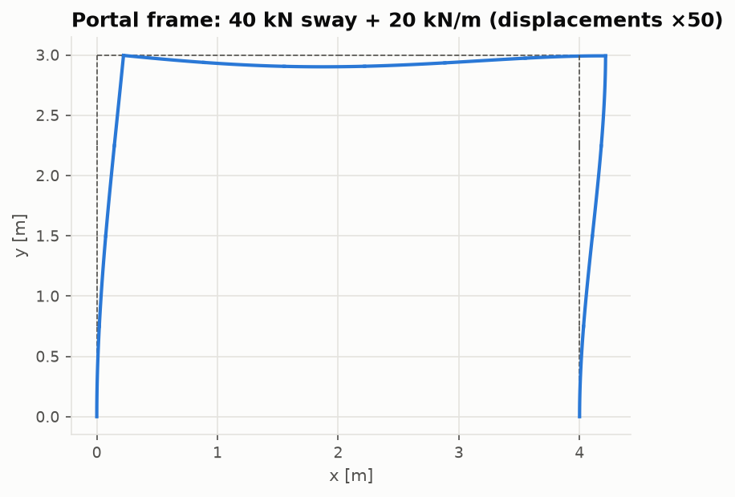

# The finite element solver

Code: [`src/structures/fea_solver/`](../src/structures/fea_solver) ·
Notebook: [`03_fea_solver.ipynb`](../notebooks/03_fea_solver.ipynb)

## Elements

Every node has three DOFs $(u, v, \theta)$. In local coordinates (x from node 1 to node 2,
length L):

**Bar (truss)**: axial stiffness only,

```math
\mathbf k_{bar} = \frac{EA}{L}\begin{bmatrix} 1 & -1 \\ -1 & 1 \end{bmatrix} \;\text{on}\; (u_1, u_2)
```

**Euler–Bernoulli frame**: the bar term plus cubic Hermite bending on $(v_1, \theta_1, v_2, \theta_2)$,

```math
\mathbf k_{b} = \frac{EI}{L^3}\begin{bmatrix} 12 & 6L & -12 & 6L \\ 6L & 4L^2 & -6L & 2L^2 \\ -12 & -6L & 12 & -6L \\ 6L & 2L^2 & -6L & 4L^2 \end{bmatrix}
```

Local quantities rotate to global axes with $\mathbf k_g = \mathbf T^{\mathsf T}\mathbf k\ \mathbf T$, where
$\mathbf T$ is block-diagonal in the direction cosines (c, s).

## Loads

A distributed load q(x) is replaced by work-equivalent ("consistent") nodal forces
$\mathbf f = \int \mathbf N^{\mathsf T} q\ dx$. For a uniform load:

```math
\mathbf f = \left[0,\; \frac{qL}{2},\; \frac{qL^2}{12},\; 0,\; \frac{qL}{2},\; -\frac{qL^2}{12}\right]^{\mathsf T}
```

The linearly varying case is coded as well. `lumped=True` drops the moments and splits the
resultant between the nodes. That is crude, and the convergence study shows what it costs.

## Assembly and solution

1. Element matrices are scattered into COO triplets and summed into a CSR global matrix
   (`scipy.sparse`).
2. DOFs are split into free (f) and restrained (r, with prescribed values $\mathbf u_r$, so support
   settlement is supported). Rotations of nodes that touch only bars are restrained
   automatically.
3. Solve and recover the reactions:

```math
\mathbf K_{ff}\mathbf u_f = \mathbf F_f - \mathbf K_{fr}\mathbf u_r, \qquad \mathbf R = \mathbf K_{rf}\mathbf u_f + \mathbf K_{rr}\mathbf u_r - \mathbf F_r
```

4. Element end forces $\mathbf f_e = \mathbf k\ \mathbf T\mathbf u_e - \mathbf f_{eq}$. The internal moment
   $M(s) = -M_1 + V_1 s + \int_0^s q(t)(s-t)\ dt$ is exact for linear loads. Deflected shapes
   use Hermite interpolation.

A mechanism gives a singular $\mathbf K_{ff}$, and the solver raises `LinAlgError`.

## Why the beam results are exact

The beam's Green's function, the deflection caused by a unit point load, is a piecewise
cubic. That lies inside the space spanned by the Hermite shape functions, so the Galerkin
solution with consistent loads is exact at the nodes for any load and any mesh (Tong, 1969).
Nodal deflections and slopes of prismatic beams are therefore exact. Between the nodes the
cubic interpolant converges as $O(h^4)$. Lumped loads have an $O(h^2)$ error at the nodes.


## Validation

| Case | Reference | Result |
|---|---|---|
| Two-bar truss, three-bar statically indeterminate truss | hand solution / compatibility | exact |
| Two-panel truss, 6-panel Pratt truss | method of joints / sections | exact |
| Cantilever, simply supported, propped, fixed–fixed beams | closed form | exact for any mesh |
| Overhanging beam with mixed loads | Phase 2 Macaulay solver | 1e-15 |
| L-frame with rigid knee | unit-load method, including axial shortening | 1e-14 |
| Rotated model | invariance | exact |
| Convergence | lumped $O(h^2)$, interpolated $O(h^4)$ | measured 2.00 and 4.00 |




## Limits

2D, linear, small displacements, Euler–Bernoulli elements (no shear deformation), no
continuum (plate or shell) elements. The geometric stiffness used for buckling is described
in [buckling.md](buckling.md).
