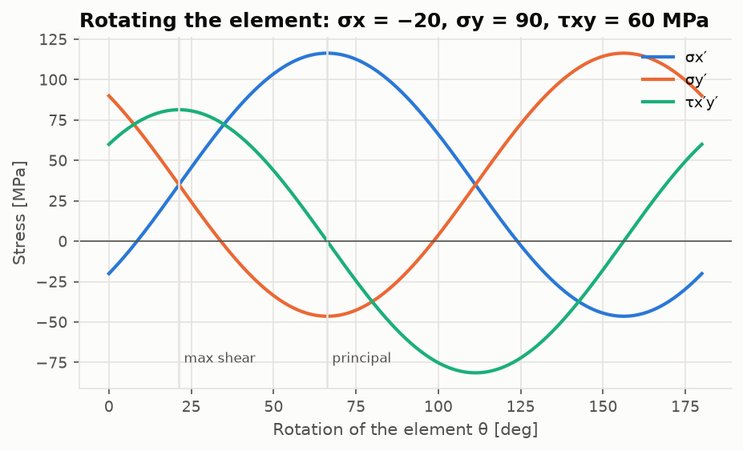

# Lesson 1 · Stress and strain at a point

> *"Is this part going to yield?"* Before we can answer, we need to describe the load at a
> point completely, find its worst orientation, and compare it with a material allowable.

**Code:** [`src/structures/stress_strain/`](../../src/structures/stress_strain) ·
**Notebook:** [`01_stress_strain.ipynb`](../../notebooks/01_stress_strain.ipynb) ·
**Next:** [Lesson 2 — Beams and torsion](02-beams-and-torsion.md)

## Learning objectives

By the end of this lesson you should be able to

1. explain why six numbers describe the state of stress at a point;
2. derive the plane-stress transformation from equilibrium of a wedge;
3. find principal stresses and the maximum shear, by formula and with Mohr's circle;
4. compute von Mises and Tresca equivalent stresses and a margin against a MIL-HDBK-5J allowable;
5. move between stress and strain with Hooke's law, in 3D, plane stress and plane strain.

---

## 1. Traction and the stress tensor

Cut a loaded body with a plane of unit normal **n**. The force per unit area on that cut is the
*traction* **t**. Cauchy showed that **t** depends linearly on **n**:

```math
\mathbf t = \boldsymbol\sigma\,\mathbf n, \qquad
\boldsymbol\sigma = \begin{bmatrix} \sigma_x & \tau_{xy} & \tau_{xz} \\ \tau_{xy} & \sigma_y & \tau_{yz} \\ \tau_{xz} & \tau_{yz} & \sigma_z \end{bmatrix}
```

Moment equilibrium of a tiny cube makes $\boldsymbol\sigma$ symmetric ($\tau_{xy} = \tau_{yx}$, ...),
so there are six independent components, not nine. Diagonal terms are normal stresses
(tension positive); off-diagonal terms are shears.

Thin aircraft skins carry load in their own plane: $\sigma_z = \tau_{xz} = \tau_{yz} = 0$. This is
**plane stress**, described by $[\sigma_x, \sigma_y, \tau_{xy}]$. That is the vector the code
passes around.

## 2. Rotating the element

The same physical state looks different in rotated axes. Take a wedge whose inclined face
has its normal at angle θ to x. Balance forces along and across that face, with face areas
$dA$, $dA\cos\theta$ and $dA\sin\theta$:

```math
\sigma_{x'} = \sigma_x\cos^2\theta + \sigma_y\sin^2\theta + 2\tau_{xy}\sin\theta\cos\theta
```

```math
\tau_{x'y'} = (\sigma_y - \sigma_x)\sin\theta\cos\theta + \tau_{xy}(\cos^2\theta - \sin^2\theta)
```

The double-angle identities give the form used in the code:

```math
\sigma_{x'} = \frac{\sigma_x+\sigma_y}{2} + \frac{\sigma_x-\sigma_y}{2}\cos 2\theta + \tau_{xy}\sin 2\theta, \qquad
\tau_{x'y'} = -\frac{\sigma_x-\sigma_y}{2}\sin 2\theta + \tau_{xy}\cos 2\theta
```

Everything depends on 2θ, so turning the element by 180° brings back the same state.



## 3. Principal stresses and Mohr's circle

Some orientation maximises the normal stress, and on it the shear vanishes. Set
$\tau_{x'y'} = 0$:

```math
\tan 2\theta_p = \frac{2\tau_{xy}}{\sigma_x - \sigma_y}, \qquad
\sigma_{1,2} = C \pm R, \quad C = \frac{\sigma_x+\sigma_y}{2}, \quad R = \sqrt{\left(\frac{\sigma_x-\sigma_y}{2}\right)^2 + \tau_{xy}^2}
```

Eliminate θ from the two transformation equations and you get a circle,
$(\sigma_{x'} - C)^2 + \tau_{x'y'}^2 = R^2$. That is **Mohr's circle**:
- every orientation of the element is a point on it;
- rotating the element by θ moves the point by 2θ;
- the principal stresses are where the circle crosses the σ axis;
- the maximum in-plane shear equals the radius R, and acts 45° from the principal planes.

`tan 2θp` alone cannot tell σ1 from σ2, because it has two solutions 90° apart. The code uses
`arctan2(2τxy, σx − σy)`, which always returns the direction of σ1.

### In 3D

The principal stresses are the eigenvalues of $\boldsymbol\sigma$ and the principal directions are
its eigenvectors. `principal_3d` calls `numpy.linalg.eigh` (symmetric matrix, so the
eigenvalues are real and the eigenvectors orthogonal). The characteristic polynomial
$\lambda^3 - I_1\lambda^2 + I_2\lambda - I_3 = 0$ shows that the invariants $I_1, I_2, I_3$ cannot
depend on the axes. The tests rotate random tensors and check exactly that.

## 4. Yield: when does a ductile metal give way?

A uniaxial test gives one number, the yield stress $F_{ty}$. A real point has a 3D state. A
*yield criterion* collapses that state into one equivalent stress to compare with $F_{ty}$.

**Tresca (maximum shear).** Metals yield by slip, and slip is driven by shear. Yield occurs
when the largest shear stress, $(\sigma_1 - \sigma_3)/2$, reaches its uniaxial value $F_{ty}/2$:

```math
\sigma_{Tresca} = \sigma_1 - \sigma_3
```

**von Mises (distortion energy).** Hydrostatic pressure changes volume but does not cause
yield. Remove it and use the energy of the remaining *distortion*:

```math
\sigma_{vM} = \sqrt{\tfrac12\left[(\sigma_1-\sigma_2)^2 + (\sigma_2-\sigma_3)^2 + (\sigma_3-\sigma_1)^2\right]}
```

The two agree in uniaxial tension and differ most in pure shear: $\sqrt3\ \tau$ for von Mises,
$2\tau$ for Tresca. So von Mises predicts shear yield at $F_{ty}/\sqrt3 = 0.577F_{ty}$ and Tresca at
$0.5F_{ty}$. Tests on aluminium alloys sit closer to von Mises. Tresca is the conservative
choice.


The safety factor is `safety_factor(s, Fy) = Fy / σ_eq`. The allowable comes from
`structures.materials.isotropic`, e.g. 2024-T3 sheet $F_{ty}$ = 48 ksi (331 MPa) on B basis,
MIL-HDBK-5J Table 3.2.3.0(b1).

## 5. Hooke's law

For a linear isotropic material, with engineering shear strain $\gamma = 2\varepsilon$:

```math
\varepsilon_x = \frac{1}{E}\left[\sigma_x - \nu(\sigma_y + \sigma_z)\right], \quad \ldots, \qquad \gamma_{xy} = \frac{\tau_{xy}}{G}, \quad G = \frac{E}{2(1+\nu)}
```

`compliance_matrix(E, nu)` returns this as a 6×6 matrix and `stiffness_matrix` returns its
inverse. Two reductions matter:
- **Plane stress** (thin sheet, $\sigma_z = 0$). Note that $\varepsilon_z = -\nu(\sigma_x + \sigma_y)/E$
  is *not* zero:

  ```math
  [D] = \frac{E}{1-\nu^2}\begin{bmatrix}1&\nu&0\\\nu&1&0\\0&0&\tfrac{1-\nu}{2}\end{bmatrix}
  ```

- **Plane strain** (thick part, $\varepsilon_z = 0$): a stiffer [D], with $\sigma_z = \nu(\sigma_x+\sigma_y)$.

## 6. Worked example

A point carries σx = −20 MPa, σy = 90 MPa and τxy = 60 MPa.

1. Centre and radius: C = 35 MPa, $R = \sqrt{55^2 + 60^2}$ = 81.39 MPa.
2. Principal stresses: σ1 = 116.39 MPa and σ2 = −46.39 MPa. The out-of-plane σ3 = 0 lies
   between them.
3. Direction: $\theta_p = \tfrac12\operatorname{atan2}(120, -110)$ = 66.26°. σ1 points
   66° from x, close to y, which makes sense because σy is the large tensile stress.
4. Maximum in-plane shear: 81.39 MPa at 21.26°. Because σ3 = 0 lies between σ1 and σ2, this is
   also the absolute maximum shear.
5. Yield: σvM = 145.3 MPa, σTresca = 162.8 MPa. Against 2024-T3 ($F_{ty}$ = 331 MPa) the safety
   factors are 2.28 (von Mises) and 2.03 (Tresca).

```python
from structures.stress_strain import principal_2d, von_mises, tresca

s = [-20e6, 90e6, 60e6]
principal_2d(s)  # (116.39e6, -46.39e6, 1.1564 rad = 66.26 deg)
von_mises(s), tresca(s)  # (145.3e6, 162.8e6)
```

## 7. From equations to code

| Concept | Function |
|---|---|
| plane transformation (broadcasts over θ) | `transform_stress_2d(s, theta)`, `transform_strain_2d` |
| 3D rotation | `transform_tensor(sigma, R)` |
| principal values | `principal_2d`, `principal_3d`, `max_shear_2d` |
| invariants | `stress_invariants` |
| yield | `von_mises`, `tresca`, `safety_factor` |
| Hooke | `compliance_matrix`, `stiffness_matrix`, `plane_stress_stiffness`, `plane_strain_stiffness` |
| Mohr | `MohrCircle`, `mohr_circles_3d`, `plot_mohr` |

## 8. Common pitfalls

- **Engineering vs tensor shear strain.** Strain gauges and FE codes report γ = 2ε. Using γ in
  the stress-transformation formula doubles the shear. `transform_strain_2d` handles it.
- **Tresca in plane stress.** If σ1 and σ2 have the same sign, the out-of-plane σ3 = 0 governs
  and the maximum shear is $\sigma_1/2$, not $(\sigma_1-\sigma_2)/2$.
- **Degrees.** Everything internal is radians. A 30 passed where 30° was meant is 1719°.
- **"Mohr's circle sign convention."** Books disagree on whether positive shear plots up or
  down. Pick one (`plot_mohr` plots positive τxy downward) and keep it.
- **Allowable basis.** A-basis and B-basis values differ. Using typical values for design is
  unconservative.

## 9. Exercises

1. A skin panel has σx = 50 MPa, σy = −30 MPa, τxy = 40 MPa. Find σ1, σ2, θp and the maximum
   in-plane shear.
2. A fuselage modelled as a thin cylinder of radius 2 m and skin thickness 1.6 mm is
   pressurised to 60 kPa. Hoop stress is pr/t and axial stress is pr/2t. Find the von Mises
   and Tresca stresses and the safety factors against 2024-T3 $F_{ty}$.
3. Show that the von Mises stress of pure shear τ is $\sqrt3\ \tau$, and that Tresca gives 2τ.
4. A 0°/45°/90° strain-gauge rosette on 2024-T3 sheet reads ε0 = 600 µε, ε45 = 500 µε and
   ε90 = −100 µε. Find γxy, the stresses, and the principal stresses. Hint:
   $\varepsilon_{45} = (\varepsilon_x + \varepsilon_y + \gamma_{xy})/2$.
5. Why does `principal_2d` use `arctan2` instead of `arctan`? Give a stress state where
   `arctan` would return the direction of σ2.

<details>
<summary>Answers</summary>

1. C = 10, R = $\sqrt{40^2 + 40^2}$ = 56.57 MPa. σ1 = 66.57 MPa, σ2 = −46.57 MPa,
   θp = 22.5°, τmax = 56.57 MPa.
2. Hoop 75.0 MPa, axial 37.5 MPa. σvM = 64.95 MPa and σTresca = 75.0 MPa: σ3 = 0 governs
   Tresca, because both in-plane stresses are tensile. SF = 5.10 (von Mises), 4.41 (Tresca).
3. With σ1 = τ, σ2 = 0, σ3 = −τ:
   $\sqrt{\tfrac12[\tau^2 + \tau^2 + 4\tau^2]} = \sqrt3\ \tau$, and σ1 − σ3 = 2τ.
4. γxy = 2(500) − 600 − (−100) = 500 µε. With E = 72.4 GPa and ν = 0.33, the stresses are
   σx = 46.06 MPa, σy = 7.96 MPa, τxy = 13.61 MPa. Principal stresses 50.43 and 3.60 MPa at
   17.8°; σvM = 48.7 MPa.
5. arctan folds 2θ into (−90°, 90°) and loses the sign of σx − σy. For σx = 0, σy = 100,
   τxy = 10 MPa, arctan(20/−100)/2 = −5.65° is the σ2 direction. σ1 is at 84.35°, which arctan2
   gives directly.

</details>

## Key takeaways

- Six numbers (three in plane stress) describe the state at a point. Rotating the axes
  changes the numbers, not the state.
- Principal stresses are eigenvalues. Mohr's circle is the 2D picture of that eigenproblem.
- Yield criteria turn a multiaxial state into one comparable number: von Mises for accuracy,
  Tresca for conservatism.
- The allowable must come from a cited source with a statistical basis.

## Further reading

- J. M. Gere & B. J. Goodno, *Mechanics of Materials*, Ch. 7 (transformation, Mohr).
- R. C. Hibbeler, *Mechanics of Materials*, Chs. 9–10.
- MIL-HDBK-5J, Ch. 1 (definitions, allowable bases) and Sec. 3.2.3 (2024 data).
