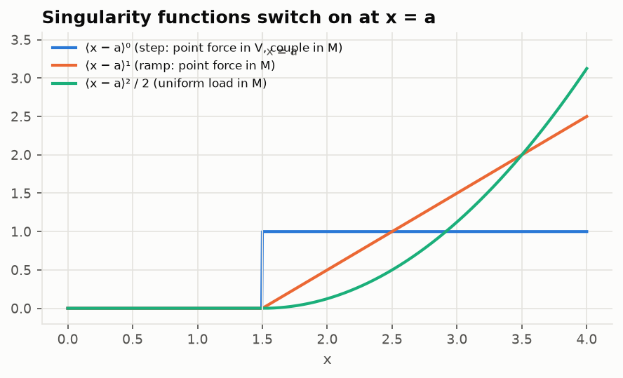

# Lesson 2 · Beams and torsion

> *"A wing is a beam."* It is a crude statement, and a remarkably useful one. This lesson
> builds a beam solver that handles any support arrangement, and shows why aircraft are made
> of closed cells.

**Code:** [`src/structures/beam_theory/`](../../src/structures/beam_theory) ·
**Notebook:** [`02_beam_theory.ipynb`](../../notebooks/02_beam_theory.ipynb) ·
**Previous:** [Lesson 1](01-stress-and-strain.md) · **Next:** [Lesson 3 — FEM](03-finite-element-method.md)

## Learning objectives

1. Derive the Euler–Bernoulli relations between load, shear, moment, slope and deflection.
2. Write any loading with singularity (Macaulay) functions.
3. Solve statically determinate *and* indeterminate beams with one linear system.
4. Compute section properties of thin-walled sections.
5. Analyse torsion of shafts, closed cells (Bredt–Batho) and open sections, and explain the
   enormous difference between the last two.

---

## 1. Euler–Bernoulli kinematics

Assume plane cross-sections stay plane and perpendicular to the deflected axis. Then the axial
strain varies linearly with the distance y from the neutral axis, $\varepsilon_x = -y\,v''$.
Integrating the stress $E\varepsilon_x$ over the section gives the moment:

```math
M = EI\,v'', \qquad \sigma_x = -\frac{My}{I}
```

Equilibrium of a slice dx gives

```math
\frac{dV}{dx} = q, \qquad \frac{dM}{dx} = V \qquad\Longrightarrow\qquad EI\,v'''' = q
```

Sign conventions used throughout: loads and v positive up, sagging M positive, couples
counter-clockwise positive. With these, a sagging moment compresses the top fibre.

## 2. Macaulay's method

Integrating $EIv'''' = q$ piece by piece between loads is tedious: every segment brings
four constants and every junction brings continuity conditions. Macaulay's idea is to use
functions that switch on at the load:

```math
\langle x - a\rangle^n = \begin{cases} (x-a)^n & x \ge a \\ 0 & x < a\end{cases},
\qquad \int \langle x-a\rangle^n dx = \frac{\langle x-a\rangle^{n+1}}{n+1}
```



The bending moment from everything to the left of x is then a single expression:

| Load | M(x) term |
|---|---|
| Upward force P at a | $P\langle x-a\rangle$ |
| Counter-clockwise couple $M_0$ at a | $-M_0\langle x-a\rangle^0$ |
| Uniform load w from a to b | $\tfrac w2\langle x-a\rangle^2 - \tfrac w2\langle x-b\rangle^2$ |

A linear ramp adds $\langle\ \rangle^3/6$ terms. Two integrations give
$EIv = \iint M + C_1x + C_2$.

## 3. One linear system for any beam

Statically determinate beams are usually solved with equilibrium first and deflections
second. Indeterminate beams need compatibility as well. The `Beam` class does both at once:

1. Treat each support reaction as a point force (plus a couple at a fixed support) with an
   **unknown** magnitude.
2. Collect the unknowns: n reactions and couples, plus $C_1$ and $C_2$.
3. Write one equation per kinematic condition:
   - v = 0 at every support,
   - v′ = 0 at every fixed support.
4. Add the two equilibrium equations, V(L⁺) = 0 and M(L⁺) = 0. Just right of the beam
   nothing is left to carry load.

Count them. A simply supported beam has 2 reactions + 2 constants = 4 unknowns, and
2 + 2 = 4 equations. A propped cantilever has 3 + 2 unknowns and 3 + 2 equations. The matrix
is square for every properly supported beam. It becomes singular if the beam can move as a
mechanism, and the solver then raises an error. Indeterminacy needs no special treatment.

**Worked example: an overhanging beam.** Fixed at x = 0, roller at 2.2 m, 600 N/m along
the whole 3 m, and 900 N at the tip, with EI = 3×10⁵ N·m². The unknowns are the fixed-end force
and couple, the roller force, $C_1$ and $C_2$: five unknowns and five equations.

```python
from structures.beam_theory import Beam, Support, DistributedLoad, PointLoad

s = (
    Beam(3.0, 3e5)
    .add(Support(0, "fixed"), Support(2.2), DistributedLoad(0, 3.0, -600.0), PointLoad(3.0, -900.0))
    .solve()
)
s.reactions  # fixed: 203.2 N and -93.0 N·m; roller: 2496.8 N
s.moment(2.2), s.deflection(3.0)  # -912 N·m (hogging), -1.60 mm
```

The reactions add up to 2700 N = 600 × 3 + 900, which is a quick check worth doing every
time. The overhang hogs the beam over the roller and lifts the back span slightly:


## 4. Section properties of thin-walled sections

Aircraft sections are thin-walled: skins, spar webs, stringers. For a wall of length l and
thickness t at angle α, the second moment about its own centroid is
$\tfrac{lt}{12}(l^2\sin^2\alpha + t^2\cos^2\alpha)$. For thin walls the $t^2$ term is negligible,
but the code keeps it, which makes the result exact for rectangles. The parallel-axis theorem
then moves each wall's contribution to the section centroid. `thin_walled(segments)` does
this for any list of walls. The tests check it against the exact I-section and the product of
inertia of an angle.

## 5. Torsion: closed versus open

**Circular shafts.** Sections stay plane and the shear stress grows linearly with radius:
$\tau = Tr/J$, twist rate $T/GJ$, $J = \pi d^4/32$.

**Closed thin-walled cell.** Take a single cell of enclosed area $A_{enc}$. Equilibrium of a
wall element shows that the *shear flow* q = τt is constant around the cell, and the torque
it carries is $T = 2A_{enc}q$ (Bredt–Batho):

```math
q = \frac{T}{2A_{enc}}, \qquad \tau = \frac{q}{t}, \qquad \frac{d\phi}{dx} = \frac{T}{4A_{enc}^2G}\oint\frac{ds}{t}
```

**Open thin-walled section.** Each wall twists like a thin strip, with
$J = \sum bt^3/3$, and the shear flows round inside the wall thickness.

Slit a thin tube of radius r and thickness t along its length and the torsional stiffness
drops by $3r^2/t^2$. For r = 50 mm and t = 1 mm that is a factor of **7500**. A closed wing box or
fuselage carries torque through a shear flow around the whole cell. An open section can only
use its wall thickness as a lever arm. This is why cut-outs (doors, access panels) need heavy
reinforcement.

**Worked example: an idealised wing box.** A rectangular cell 600 mm × 150 mm with 2 mm skins
and 3 mm spars, in 2024-T3 (G = 27.6 GPa), carries T = 20 kN·m:
- $A_{enc}$ = 0.09 m², so q = 20 000 / (2 × 0.09) = 111.1 kN/m.
- Skin shear stress 55.6 MPa, spar shear stress 37.0 MPa.
- $\oint ds/t$ = 2(0.6/0.002) + 2(0.15/0.003) = 700, so the twist rate is
  20 000 × 700 / (4 × 0.09² × 27.6×10⁹) = 0.0157 rad/m = 0.90°/m.

## 6. Common pitfalls

- **Sign conventions.** Most beam errors are sign errors. Fix one convention and check
  reactions by equilibrium.
- **End values.** M and V jump at point loads. At the right end of the beam the code returns
  the left-hand limit, because the right-hand limit is zero by equilibrium.
- **Rounded coefficients.** Handbook formulas such as $wL^4/185EI$ are rounded. In this
  project they disagreed with the solver at the 10⁻³ level until the exact expressions were
  used.
- **Shear deformation.** Euler–Bernoulli ignores it. For deep, short beams (L/h < ~10) it
  matters, and Timoshenko theory is needed.
- **Open sections in torsion.** They also warp, and restraining the warping (e.g. at a root)
  changes the stiffness. Saint-Venant J alone is not the full story.

## 7. Exercises

1. A simply supported 2024-T3 beam, 3 m long, has a 50 × 100 mm rectangular section and
   carries 10 kN at 1 m from the left support. Find the reactions, the maximum moment, the
   maximum bending stress and the maximum deflection with its location.
2. Derive the prop reaction 3wL/8 of a uniformly loaded propped cantilever by superposition:
   cantilever under w, plus an upward tip force R, with zero tip deflection.
3. Repeat the wing-box example with the spars thinned to 2 mm. What happens to the spar shear
   stress and to the twist rate?
4. How many unknowns and equations does the Macaulay system have for a beam on four simple
   supports? Is the result different from a beam on three supports and one fixed end?
5. A thin-walled channel has a 100 mm web and two 50 mm flanges, all 2 mm thick. Use
   `thin_walled` to find A, I about the horizontal centroidal axis, and J.

<details>
<summary>Answers</summary>

1. EI = 72.4 GPa × 4.167×10⁻⁶ m⁴ = 3.016×10⁵ N·m². Reactions 6.667 kN (left) and 3.333 kN.
   $M_{max}$ = Pab/L = 6.667 kN·m under the load. $\sigma_{max} = M/S$ = 6667 / 8.333×10⁻⁵ =
   80.0 MPa. $v_{max}$ = 16.04 mm at x = 1.367 m, i.e. $\sqrt{(L^2 - b^2)/3}$ = 1.633 m from the
   right support. The `closed_form` reference got this location wrong for loads left of
   midspan until this exercise exposed it.
2. Cantilever tip deflection under w: $wL^4/8EI$ down. Under an upward tip force R:
   $RL^3/3EI$ up. Zero total gives R = 3wL/8.
3. q is unchanged (it depends only on T and $A_{enc}$). The spar stress rises to
   q/0.002 = 55.6 MPa. $\oint ds/t$ = 2(300) + 2(75) = 750, so the twist rate rises by 750/700,
   to 0.96°/m.
4. Four simple supports: 4 reactions + 2 constants = 6 unknowns, and 4 (v = 0) + 2
   (equilibrium) = 6 equations. Three supports plus a fixed end: 4 forces + 1 couple + 2
   constants = 7 unknowns, and 4 + 1 + 2 = 7 equations. Both are square, so the method does
   not care about the degree of indeterminacy.
5. A = 4.0×10⁻⁴ m², I = 6.667×10⁻⁷ m⁴, J = 5.33×10⁻¹⁰ m⁴ (Σbt³/3 = 0.2 × 0.002³ / 3).

</details>

## Key takeaways

- $EIv'''' = q$ with four boundary conditions is the whole of Euler–Bernoulli beam theory.
- Treat reactions as unknown loads, and determinate and indeterminate beams are the same
  problem.
- Closed cells carry torque by shear flow around the cell. Open sections are thousands of
  times more flexible in torsion.

## Further reading

- T. H. G. Megson, *Aircraft Structures for Engineering Students*, Chs. 15–18 (bending, shear,
  torsion of thin-walled beams).
- J. M. Gere & B. J. Goodno, *Mechanics of Materials*, Chs. 9–10 (deflections, statically
  indeterminate beams).
- W. C. Young & R. G. Budynas, *Roark's Formulas for Stress and Strain*, Tables 8.1 and 10.7.
