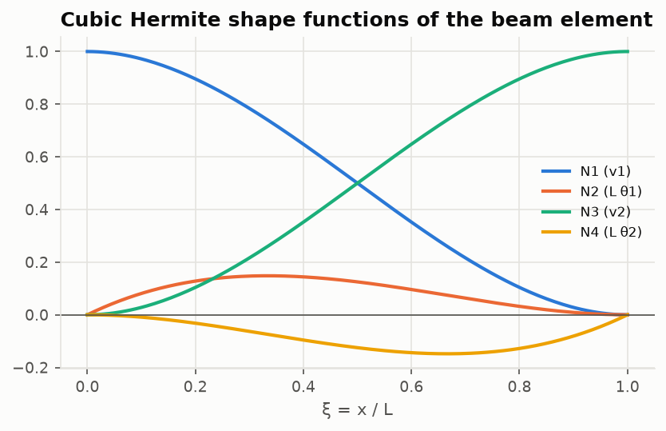
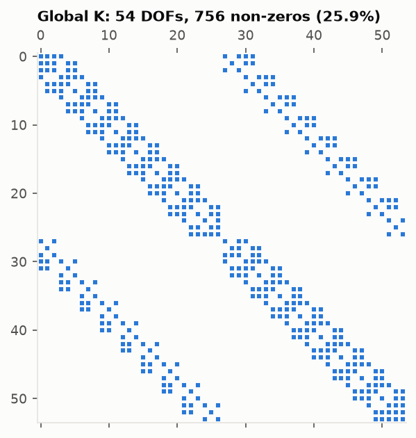

# Lesson 3 · The finite element method, from scratch

> *"What is NASTRAN actually solving?"* Under the menus, every linear static analysis is
> **K u = F**. This lesson builds K one element at a time, applies supports, solves, and then
> asks how accurate the answer is.

**Code:** [`src/structures/fea_solver/`](../../src/structures/fea_solver) ·
**Notebook:** [`03_fea_solver.ipynb`](../../notebooks/03_fea_solver.ipynb) ·
**Previous:** [Lesson 2](02-beams-and-torsion.md) · **Next:** [Lesson 4 — Buckling](04-buckling.md)

## Learning objectives

1. Derive bar and beam element stiffness matrices from shape functions and strain energy.
2. Transform element matrices to global axes and assemble a sparse global stiffness matrix.
3. Apply supports by partitioning, including prescribed displacements, and recover reactions.
4. Convert distributed loads to consistent nodal loads, and explain why lumping them is worse.
5. Predict and measure convergence rates.

---

## 1. The idea

Split the structure into elements joined at nodes. Inside each element, approximate the
displacement field with a few *shape functions* weighted by the nodal displacements. Then
require the total potential energy to be stationary (equivalently, the principle of virtual
work):

```math
\Pi = \tfrac12\,\mathbf u^{\mathsf T}\mathbf K\mathbf u - \mathbf u^{\mathsf T}\mathbf F, \qquad \frac{\partial\Pi}{\partial\mathbf u} = 0 \;\Longrightarrow\; \mathbf K\mathbf u = \mathbf F
```

A beam problem becomes a matrix problem. Everything below is a detail of how to build
**K** and **F**.

## 2. Element matrices

**Bar.** Axial displacement varies linearly between the nodes:
$u(x) = (1-\xi)u_1 + \xi u_2$ with $\xi = x/L$. The strain is $(u_2 - u_1)/L$, and the strain
energy $\tfrac12\int EA\ u'^2 dx$ gives

```math
\mathbf k_{bar} = \frac{EA}{L}\begin{bmatrix} 1 & -1 \\ -1 & 1\end{bmatrix}
```

**Beam.** Bending needs both deflection and slope continuous across the nodes, so each node
carries $(v, \theta)$ and the interpolation is cubic: the **Hermite** shape functions.



With $v(x) = \mathbf N\mathbf d$ and curvature $v'' = \mathbf N''\mathbf d$, the bending energy
$\tfrac12\int EI\ v''^2dx = \tfrac12\mathbf d^{\mathsf T}\mathbf k\ \mathbf d$ gives

```math
\mathbf k_b = \int_0^L EI\,\mathbf N''^{\mathsf T}\mathbf N''\,dx = \frac{EI}{L^3}\begin{bmatrix} 12 & 6L & -12 & 6L \\ 6L & 4L^2 & -6L & 2L^2 \\ -12 & -6L & 12 & -6L \\ 6L & 2L^2 & -6L & 4L^2\end{bmatrix}
```

The 2D **frame element** combines the two: 3 DOFs per node $(u, v, \theta)$, 6×6 matrix. A
quick health check is that an unsupported element has exactly three zero-energy modes (two
translations and a rotation). The tests count them.

## 3. From local to global

The element matrix is written in the element's own axes. For an element at angle φ, with
c = cos φ and s = sin φ,

```math
\mathbf u_{local} = \mathbf T\,\mathbf u_{global}, \quad \mathbf T = \operatorname{diag}(\mathbf r, \mathbf r), \quad \mathbf r = \begin{bmatrix} c & s & 0 \\ -s & c & 0 \\ 0 & 0 & 1\end{bmatrix}, \qquad \mathbf k_{global} = \mathbf T^{\mathsf T}\mathbf k\,\mathbf T
```

**Assembly** adds each element's 6×6 block into the rows and columns of its six global DOFs
(3 × node index + 0, 1, 2). The code does not loop over a dense matrix. It collects (row, col,
value) triplets, builds a COO matrix, and converts to CSR. Duplicate entries are summed
automatically, and that summing *is* the assembly.



The matrix is mostly zeros, because each DOF couples only to its neighbours. The off-diagonal
bands come from numbering all bottom nodes before all top nodes. Renumbering to keep connected
nodes close (Cuthill–McKee) would pull them towards the diagonal.

## 4. Supports and solution

Split the DOFs into free (f) and restrained (r) sets, with prescribed values $\mathbf u_r$
(zero, or a support settlement):

```math
\begin{bmatrix}\mathbf K_{ff} & \mathbf K_{fr}\\ \mathbf K_{rf} & \mathbf K_{rr}\end{bmatrix}\begin{bmatrix}\mathbf u_f\\\mathbf u_r\end{bmatrix} = \begin{bmatrix}\mathbf F_f\\\mathbf F_r + \mathbf R\end{bmatrix}
\quad\Longrightarrow\quad
\mathbf K_{ff}\mathbf u_f = \mathbf F_f - \mathbf K_{fr}\mathbf u_r, \qquad \mathbf R = \mathbf K_{rf}\mathbf u_f + \mathbf K_{rr}\mathbf u_r - \mathbf F_r
```

$\mathbf K_{ff}$ is symmetric positive definite if the supports prevent rigid-body motion, and
singular otherwise. The solver turns SciPy's singular-matrix warning into a clear error. One
practical detail: the rotation of a node attached only to bars has no stiffness at all, so
the solver restrains it automatically.

**Post-processing.** Element end forces are $\mathbf f = \mathbf k\ \mathbf T\mathbf u_e - \mathbf f_{eq}$.
The second term removes the element's own equivalent loads. Without it, a uniformly loaded
beam would show the wrong end moments.

## 5. Loads: consistent versus lumped

A distributed load q(x) does work $\int v\ q\ dx = \mathbf d^{\mathsf T}\int\mathbf N^{\mathsf T}q\ dx$.
The work-equivalent ("consistent") nodal load vector is therefore $\int\mathbf N^{\mathsf T}q\ dx$.
For a uniform load:

```math
\mathbf f = \left[\frac{qL}{2},\ \frac{qL^2}{12},\ \frac{qL}{2},\ -\frac{qL^2}{12}\right]^{\mathsf T}
```

The end moments are not optional. Drop them ("lumped" loads) and the answer converges only as
$h^2$.

## 6. How accurate is it?

For beams, something special happens. The deflection caused by a point load (the Green's
function) is a piecewise cubic, and cubics are exactly what Hermite elements can represent.
So **the nodal displacements are exact for any mesh and any load**, provided the loads are
consistent (Tong, 1969). Between the nodes the interpolation error is $O(h^4)$.


The figure is the most important validation in this module. Each curve has the slope theory
predicts: round-off for consistent nodal values, −2 for lumped loads, −4 for interpolation.
A solver with an assembly bug almost never shows the right convergence rate. Measuring the
order is a much stronger test than comparing one number.

## 7. Worked example: a two-panel truss by hand and by code

Nodes A(0,0), B(2,0), C(4,0), D(2,1.5). Bars AB, BC, AD, DC, BD. A 10 kN load acts down at B.
A is pinned and C is on a roller.

By joints: the reactions are 5 kN each. At B, BD must carry the whole load: N_BD = +10 kN.
At A, with tan α = 1.5/2, $N_{AD} = -5/\sin\alpha$ = −8.333 kN and
$N_{AB} = -N_{AD}\cos\alpha$ = +6.667 kN.

```python
from structures.fea_solver import Model

m = Model()
A, B, C, D = (m.add_node(*p) for p in [(0, 0), (2, 0), (4, 0), (2, 1.5)])
bars = [m.add_bar(i, j, 200e9, 1e-3) for i, j in [(A, B), (B, C), (A, D), (D, C), (B, D)]]
m.fix(A, "xy").fix(C, "y").load(B, fy=-10e3)
s = m.solve()
[s.axial_force(b) / 1e3 for b in bars]  # [6.667, 6.667, -8.333, -8.333, 10.0]
```

The truss is statically determinate, so the forces do not depend on E or A. The
displacements do.

## 8. Common pitfalls

- **Mechanisms.** A missing support or a pin-jointed node with too few bars gives a singular
  K. Read the error and count the DOFs.
- **Forgetting $\mathbf f_{eq}$** when recovering element forces from a distributed load.
- **Lumping loads** and then concluding the mesh must be refined much further than necessary.
- **Mixed units.** Pa with mm, or kN with N. Stay in SI throughout.
- **Ill-conditioning.** Huge stiffness contrasts, such as a "rigid" link modelled with
  E × 10¹², lose digits. The consistent-load error in the convergence plot rises to 3×10⁻¹¹ at
  64 elements for the same reason (it grows as $h^{-4}$).

## 9. Exercises

1. Derive the bar stiffness matrix from the strain energy $\tfrac12\int_0^L EA\ u'^2dx$ with
   linear shape functions.
2. A symmetric two-bar truss spans 3 m with its apex 1 m high. E = 70 GPa, A = 400 mm², and a
   5 kN load acts down at the apex. Find the bar force and the apex deflection by hand, then
   check with the code.
3. Model a cantilever with a single beam element and a tip load P. Reduce K to the two free
   DOFs and solve for the tip deflection and slope. Compare with the exact values.
4. Find the consistent nodal loads for a load rising linearly from 0 at node 1 to q at node 2.
5. Explain in one paragraph why lumped loads give $O(h^2)$ nodal error while consistent loads
   give none.

<details>
<summary>Answers</summary>

1. $u' = (u_2 - u_1)/L$, so

   ```math
   U = \frac{EA}{2L}(u_2-u_1)^2 = \frac12\begin{bmatrix}u_1 & u_2\end{bmatrix}\frac{EA}{L}\begin{bmatrix}1&-1\\-1&1\end{bmatrix}\begin{bmatrix}u_1\\u_2\end{bmatrix}
   ```

2. Bar length 1.803 m, sin α = 0.5547. N = −P/(2 sin α) = −4.507 kN (compression).
   δ = P L / (2EA sin²α) with L = 1.803 m the bar length: 0.523 mm down.
3. The node-2 rows and columns of $\mathbf k_b$ give

   ```math
   \frac{EI}{L^3}\begin{bmatrix}12 & -6L\\ -6L & 4L^2\end{bmatrix}\begin{bmatrix}v_2\\\theta_2\end{bmatrix} = \begin{bmatrix}-P\\0\end{bmatrix}
   ```

   This gives $v_2 = -PL^3/3EI$ and
   $\theta_2 = -PL^2/2EI$: exact, as Tong's theorem promises.
4. $[3qL/20,\ qL^2/30,\ 7qL/20,\ -qL^2/20]$. Check: the forces sum to qL/2, the resultant.
5. Consistent loads make the discrete problem the exact Galerkin projection. Because the
   Green's function lies in the cubic space, the nodal values are exact. Lumping changes the
   load itself. It replaces the distributed load with point forces and omits the end moments
   $\pm qh^2/12$. The difference is a self-equilibrated set of couples of size $qh^2$ per
   element, whose effect on the deflection is $O(h^2)$.

</details>

## Key takeaways

- FEM is energy minimisation over a finite set of shape functions. **K u = F** is what it
  produces.
- Assembly is addition: sparse triplets summed into a global matrix.
- Supports partition the system. Reactions come for free afterwards.
- Check the *order* of convergence, not just one comparison. It catches bugs that a single
  number hides.

## Further reading

- R. D. Cook, D. S. Malkus, M. E. Plesha & R. J. Witt, *Concepts and Applications of Finite
  Element Analysis*, Chs. 1–4.
- J. S. Przemieniecki, *Theory of Matrix Structural Analysis* (the direct stiffness method in
  aerospace practice).
- P. Tong, "Exact solution of certain problems by finite-element method", *AIAA Journal* 7(1),
  1969.
