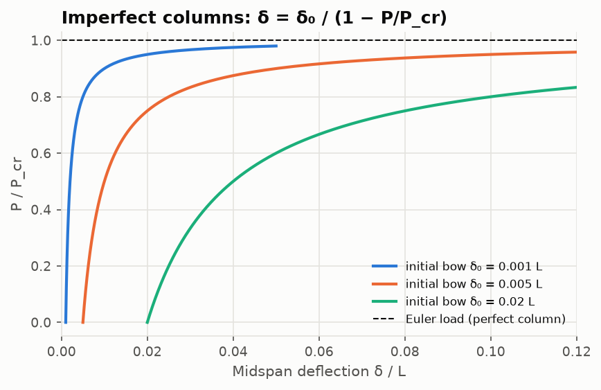

# Lesson 4 · Buckling

> *"The strut didn't break. It got out of the way."* Thin aerospace structures usually fail by
> instability long before the material yields. This lesson treats columns and skin panels,
> and turns buckling into an eigenvalue problem for the FEA solver.

**Code:** [`src/structures/buckling/`](../../src/structures/buckling) ·
**Notebook:** [`04_buckling.ipynb`](../../notebooks/04_buckling.ipynb) ·
**Previous:** [Lesson 3](03-finite-element-method.md) · **Next:** [Lesson 5 — Composite laminates](05-composite-laminates.md)

## Learning objectives

1. Derive the Euler load from the buckled-shape equilibrium, for any end conditions.
2. Use effective length and slenderness, and decide between elastic and inelastic buckling.
3. Apply the Johnson parabola and the tangent-modulus method with MIL-HDBK-5J data.
4. Compute skin-panel buckling stresses and explain the k-versus-aspect-ratio curve.
5. Formulate and solve linear buckling as a generalised eigenproblem with the FEA solver.

---

## 1. Why buckling is different

Every previous lesson assumed that equilibrium can be written on the *undeformed* geometry.
Buckling is what happens when that assumption fails. Take a straight column under axial load
P. In a slightly bent position, the load acts through the lateral deflection v and adds a
moment −Pv:

```math
EI\,v'' = -P\,v \quad\Longrightarrow\quad EI\,v'''' + P\,v'' = 0
```

For small P the only solution is v = 0. At certain loads a bent shape also satisfies
equilibrium, and the column can buckle. Those loads are eigenvalues and the shapes are
eigenvectors.

## 2. The Euler load

With $k^2 = P/EI$, the general solution is $v = A\sin kx + B\cos kx + Cx + D$. Applying four end
conditions gives a homogeneous system, and a non-zero solution needs its determinant to vanish.

- **Pinned–pinned** (v = v″ = 0 at both ends): sin kL = 0, so kL = π and
  $P_{cr} = \pi^2EI/L^2$, with mode sin(πx/L).
- **Fixed–free**: kL = π/2, so K = 2. A flagpole is four times weaker than the same bar pinned
  at both ends.
- **Fixed–fixed**: kL = 2π, so K = 0.5.
- **Fixed–pinned**: tan kL = kL, so kL = 4.4934 and K = 0.6992.

Every case can be written as

```math
P_{cr} = \frac{\pi^2EI}{(KL)^2}, \qquad F_c = \frac{P_{cr}}{A} = \frac{\pi^2E}{(L'/\rho)^2}, \quad L' = KL,\ \rho = \sqrt{I/A}
```

The **slenderness** $L'/\rho$ is the one number that matters.

## 3. Real columns: yield, imperfection, plasticity

The Euler stress grows without bound as the column gets shorter, but the material cannot
follow. Two effects take over.

**Imperfections.** A column with an initial bow $\delta_0\sin(\pi x/L)$ deflects
$\delta = \delta_0/(1 - P/P_{cr})$. It bends progressively instead of bifurcating, and yields
before it reaches $P_{cr}$:



**Plasticity.** Near yield the stress-strain curve flattens, so the effective stiffness drops.
Engesser's tangent-modulus theory replaces E with $E_t = d\sigma/d\varepsilon$ at the buckling
stress (MIL-HDBK-5J Eq. 1.3.8(a)). With the Ramberg–Osgood curve
$\varepsilon = f/E + 0.002(f/F_{0.2})^n$, the column stress solves the implicit equation

```math
F_c = \frac{\pi^2E_t(F_c)}{(L'/\rho)^2}, \qquad \frac1{E_t} = \frac1E + \frac{0.002\,n\,F_c^{\,n-1}}{F_{0.2}^{\,n}}
```

which `tangent_modulus_stress` solves with Brent's method. A simpler, widely used
alternative is the **Johnson parabola**, tangent to Euler at half the compressive yield:

```math
F_c = F_{cy} - \frac{F_{cy}^2}{4\pi^2E}\left(\frac{L'}{\rho}\right)^2 \quad\text{for}\quad \frac{L'}{\rho} < \pi\sqrt{\frac{2E}{F_{cy}}}
```


**Worked example: a 2024-T3 tube strut.** The tube is 25 × 1.5 mm, pinned at both ends.
- Section: A = 110.7 mm², ρ = 8.33 mm.
- Material: $E_c$ = 73.8 GPa and $F_{cy}$ = 276 MPa (40 ksi, MIL-HDBK-5J B-basis).
- Transition slenderness: $\pi\sqrt{2E_c/F_{cy}}$ = 72.7.

| Length | L'/ρ | Euler | Johnson | Tangent modulus (n = 15) | Governing load |
|---|---|---|---|---|---|
| 0.4 m | 48.0 | 315 MPa (> F_cy!) | 216 MPa | 223 MPa | 23.9 kN (Johnson) |
| 1.0 m | 120.1 | 50.5 MPa | 50.5 MPa | 50.5 MPa | 5.59 kN (elastic) |

The short strut shows why Euler alone is unsafe: it predicts a stress above yield. The two
inelastic models agree to within 4 %.

## 4. Skin panels

A skin panel between stringers and ribs is a plate. Plate theory gives

```math
\sigma_{cr} = k\,\frac{\pi^2E}{12(1-\nu^2)}\left(\frac tb\right)^2
```

For a plate simply supported on all edges and compressed along its length a, it buckles into
m half-waves:

```math
k = \left(\frac{mb}{a} + \frac{a}{mb}\right)^2 \quad\text{minimised over } m
```

The minimum is k = 4 whenever a/b is an integer. A long plate always buckles into roughly
square half-waves, so k stays close to 4. The scalloped curve in the figure is the envelope
of the curves for m = 1, 2, 3, …


**Example.** A 2024-T3 skin bay 150 mm wide, 450 mm long and 1.6 mm thick (a/b = 3, so k = 4)
buckles at 31 MPa. That is 11 % of $F_{cy}$. Thin skins buckle early. Aircraft are designed
for it: the buckled skin goes on carrying load as a tension field, and the stringers carry the
compression. That post-buckling behaviour is beyond this project.

## 5. Buckling as a finite element eigenproblem

The extra moment Pv in Section 1 has an energy counterpart: the work done by the axial force as
the member shortens through bending, $-\tfrac12\int N\,v'^2dx$. With the Hermite shape functions
this gives the **geometric stiffness**, linear in the axial force N:

```math
\mathbf k_G = \frac{N}{30L}\begin{bmatrix} 36 & 3L & -36 & 3L \\ 3L & 4L^2 & -3L & -L^2 \\ -36 & -3L & 36 & -3L \\ 3L & -L^2 & -3L & 4L^2\end{bmatrix}
```

Compression (N < 0) *reduces* the total stiffness $\mathbf K + \lambda\mathbf K_G$. The structure
buckles when the total stiffness becomes singular:

```math
(\mathbf K + \lambda\,\mathbf K_G)\,\boldsymbol\phi = 0
```

`linear_buckling` takes three steps:
1. Solve a static problem under a reference load to get each element's N.
2. Assemble $\mathbf K_G$.
3. Solve the symmetric-definite problem $-\mathbf K_G\boldsymbol\phi = \mu\mathbf K\boldsymbol\phi$
   (`scipy.linalg.eigh`), with critical load factors $\lambda = 1/\mu$.


With 16 elements all four end conditions match Euler to 3.3×10⁻⁵ or better. The FEA load is
always slightly high, because the cubic shape functions make the discrete structure stiffer
than the real one, and the error falls as $h^4$.

## 6. Common pitfalls

- **Euler for stocky columns.** Always check $L'/\rho$ against the transition slenderness.
- **The wrong modulus.** Use $E_c$ (compression) for buckling. The handbook gives it
  separately from E.
- **Theoretical K for real joints.** Real ends are neither perfectly pinned nor perfectly
  fixed. Design codes recommend larger K than theory for "fixed" ends.
- **Bifurcation is not strength.** Linear buckling assumes a perfect structure. Shells in
  particular can fail far below their linear buckling load because of imperfections.
- **Local buckling and crippling** of thin flanges can come before column buckling. Check both.

## 7. Exercises

1. Show that a fixed–free column has $P_{cr} = \pi^2EI/4L^2$, and sketch its mode.
2. The 25 × 1.5 mm 2024-T3 tube is used as a fixed–free strut 0.5 m long. Which regime is it
   in, and what is its buckling load by Johnson–Euler?
3. Find k and the number of half-waves for a simply supported plate with a/b = 2.5, and for
   a/b = 0.7.
4. A column with initial bow L/1000 carries 80 % of its Euler load. What is the midspan
   deflection?
5. The FEA buckling error of a fixed–fixed column is 5.1×10⁻⁴ with 8 elements. Predict the
   error with 16 elements and with 32.

<details>
<summary>Answers</summary>

1. With v(0) = v′(0) = 0 and zero moment and shear at the free end, the general solution
   reduces to $v = \delta(1 - \cos kx)$ with cos kL = 0, so kL = π/2 and
   $P = \pi^2EI/(2L)^2$. The mode is a quarter cosine wave.
2. L′ = 2 × 0.5 = 1.0 m, so L′/ρ = 120 > 72.7: elastic. $F_c$ = 50.5 MPa and P = 5.59 kN, the
   same as the 1 m pinned strut, because only L′ matters.
3. a/b = 2.5: m = 3, k = (3/2.5 + 2.5/3)² = 4.134 (m = 2 gives 4.203). a/b = 0.7: m = 1,
   k = (1/0.7 + 0.7)² = 4.531.
4. δ = δ₀/(1 − 0.8) = 5δ₀ = L/200.
5. With $h^4$ convergence each halving divides the error by 16: about 3.2×10⁻⁵ at 16 elements
   (measured 3.3×10⁻⁵) and about 2×10⁻⁶ at 32.

</details>

## Key takeaways

- Buckling is an eigenvalue problem. The critical loads are where the stiffness matrix,
  including the destabilising effect of compression, becomes singular.
- Slenderness L′/ρ decides between elastic (Euler) and inelastic (Johnson, tangent modulus)
  failure.
- Thin skins buckle at a small fraction of yield. Aircraft structures are designed to work
  past that point.

## Further reading

- S. P. Timoshenko & J. M. Gere, *Theory of Elastic Stability*, Chs. 2 and 9.
- E. F. Bruhn, *Analysis and Design of Flight Vehicle Structures*, Chs. C2 and C5.
- MIL-HDBK-5J, Secs. 1.3.8, 1.3.9 and 1.6 (column formulas, Ramberg–Osgood, column test data).
