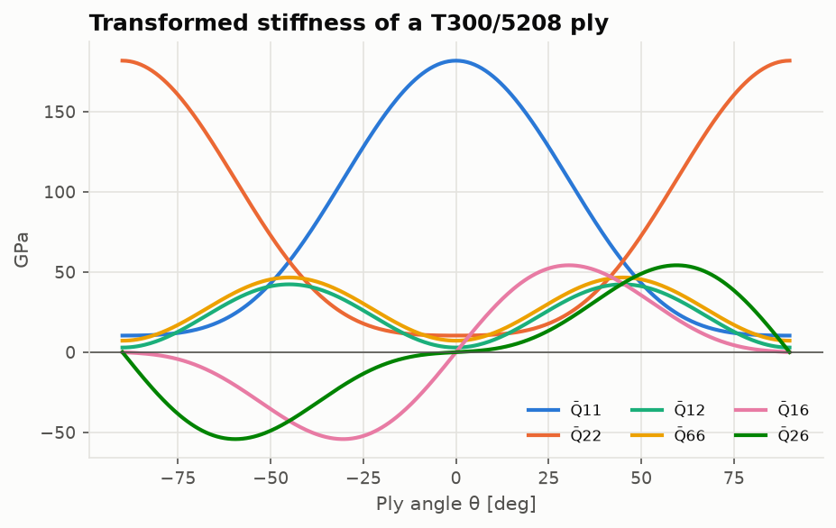
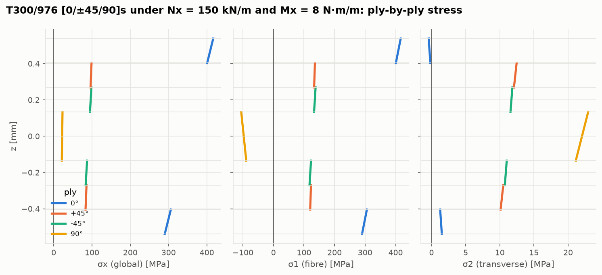
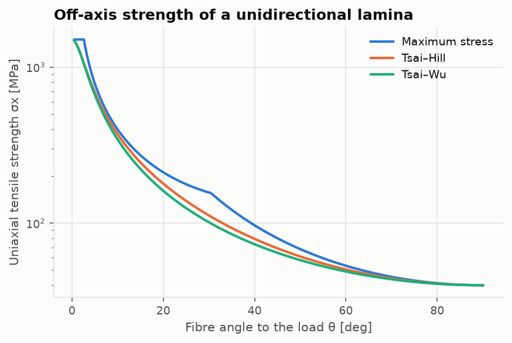
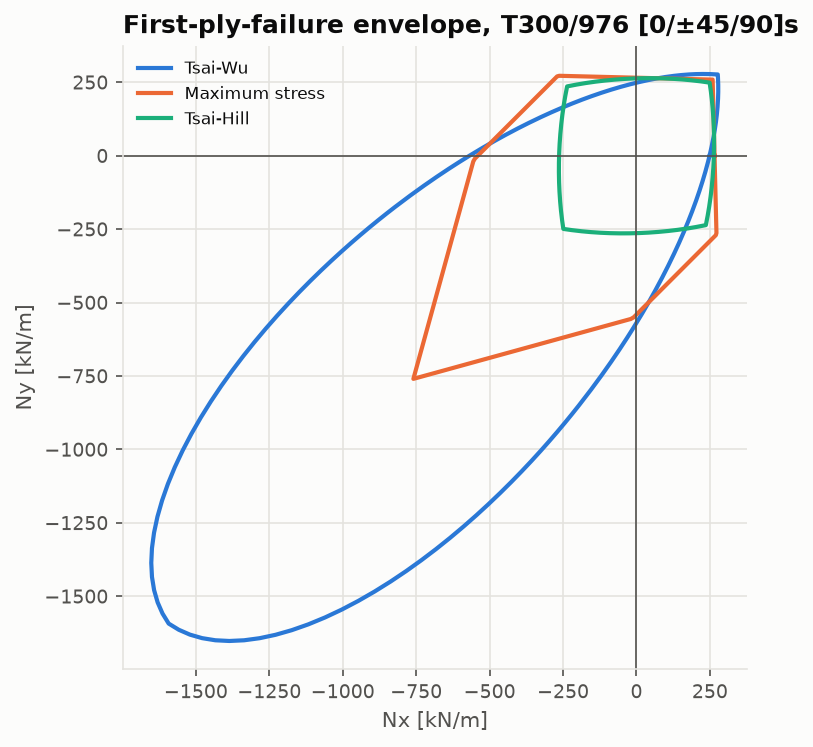

# Lesson 5 · Composite laminates

> *"Put the fibres where the loads are."* A carbon/epoxy ply is very strong along its fibres
> and weak across them. A laminate stacks plies at different angles to suit the loads.
> Classical Lamination Theory (CLT) predicts its stiffness and the stress in every ply.

**Code:** [`src/structures/composite_laminates/`](../../src/structures/composite_laminates) ·
**Notebook:** [`05_composite_laminates.ipynb`](../../notebooks/05_composite_laminates.ipynb) ·
**Previous:** [Lesson 4](04-buckling.md) · **Next:** [Lesson 6 — Fatigue](06-fatigue.md)

## Learning objectives

1. Write the plane-stress stiffness of an orthotropic ply and rotate it to any angle.
2. Assemble the ABD matrix and read coupling behaviour from its structure.
3. Recover ply-by-ply strains and stresses for given force and moment resultants.
4. Apply maximum-stress, maximum-strain, Tsai–Hill and Tsai–Wu criteria as strength ratios.
5. Run a first-ply and ply-by-ply failure analysis, and reproduce Kaw's worked examples.

---

## 1. One ply

A unidirectional ply is orthotropic, with fibre direction 1 and transverse direction 2. In plane
stress four constants describe it: $E_1, E_2, G_{12}, \nu_{12}$. For T300/5208 (Kaw Table 2.1)
they are 181 GPa, 10.3 GPa, 7.17 GPa and 0.28. The fibre direction is 18 times stiffer than the
transverse one.

```math
\mathbf Q = \begin{bmatrix} \dfrac{E_1}{1-\nu_{12}\nu_{21}} & \dfrac{\nu_{12}E_2}{1-\nu_{12}\nu_{21}} & 0 \\ \dfrac{\nu_{12}E_2}{1-\nu_{12}\nu_{21}} & \dfrac{E_2}{1-\nu_{12}\nu_{21}} & 0 \\ 0 & 0 & G_{12}\end{bmatrix}
= \begin{bmatrix} 181.8 & 2.897 & 0 \\ 2.897 & 10.35 & 0 \\ 0 & 0 & 7.17\end{bmatrix}\text{ GPa}
```

(reciprocity: $\nu_{21} = \nu_{12}E_2/E_1$ = 0.0159).

## 2. Rotating the ply

A ply at angle θ to the laminate x-axis has a stiffness $\bar{\mathbf Q}$ in laminate axes. Stresses
transform with **T** (the Lesson 1 rotation written as a 3×3 matrix). Engineering strains need
the Reuter matrix R = diag(1, 1, 2) because γ = 2ε:

```math
\bar{\mathbf Q} = \mathbf T^{-1}\,\mathbf Q\,\mathbf R\,\mathbf T\,\mathbf R^{-1}
```



Note the coupling terms $\bar Q_{16}$ and $\bar Q_{26}$. An off-axis ply stretched along x also
shears. At ±45° the in-plane shear stiffness $\bar Q_{66}$ peaks. That is why ±45° plies are
used to carry shear. The **invariants** $U_1 \ldots U_5$ give the same matrix as
$U_1 + U_2\cos2\theta + U_3\cos4\theta$ and similar terms. They make it plain that part of the
stiffness ($U_1$, $U_4$, $U_5$) does not depend on orientation at all.

## 3. Stacking plies: the ABD matrix

Kirchhoff plate kinematics apply: normals stay straight, so the strain through the thickness
is $\boldsymbol\varepsilon(z) = \boldsymbol\varepsilon^0 + z\boldsymbol\kappa$. Integrating
$\bar{\mathbf Q}_k\boldsymbol\varepsilon(z)$ over the thickness gives the force resultants **N**
(N/m), and integrating the first moment gives the moment resultants **M** (N·m/m):

```math
\begin{bmatrix}\mathbf N\\\mathbf M\end{bmatrix} = \begin{bmatrix}\mathbf A&\mathbf B\\\mathbf B&\mathbf D\end{bmatrix}\begin{bmatrix}\boldsymbol\varepsilon^0\\\boldsymbol\kappa\end{bmatrix}, \quad
A_{ij} = \sum_k \bar Q_{ij}^{(k)}(h_k - h_{k-1}),\ B_{ij} = \tfrac12\sum_k\bar Q_{ij}^{(k)}(h_k^2-h_{k-1}^2),\ D_{ij} = \tfrac13\sum_k\bar Q_{ij}^{(k)}(h_k^3-h_{k-1}^3)
```

Reading the matrix:

| Term | Couples | Zero when |
|---|---|---|
| $A_{16}, A_{26}$ | stretching ↔ in-plane shear | balanced: every +θ ply has a −θ ply |
| **B** | stretching ↔ bending/twisting | symmetric about the mid-plane |
| $D_{16}, D_{26}$ | bending ↔ twisting | no off-axis plies, or antisymmetric layups (which have B ≠ 0); small when ±θ plies sit next to each other |

An unsymmetric [0/90] laminate has $B_{11} = -B_{22}$: pull it and it curls. Cured flat, it warps
on cooling for the same reason. Aircraft laminates are symmetric and balanced almost without
exception.

**Kaw's example.** The layup is [0/90/0] T300/5208 with 5 mm plies, a thickness chosen so the
numbers are easy to follow.

```python
from structures.composite_laminates import Laminate
from structures.materials import ply

lam = Laminate.from_angles(ply("T300/5208"), [0, 90, 0], 0.005)
lam.A  # [[1.870e9, 4.345e7, 0], [4.345e7, 1.013e9, 0], [0, 0, 1.076e8]] Pa·m
lam.engineering_constants()  # Ex 124.5 GPa, Ey 67.43 GPa, Gxy 7.17 GPa, nuxy 0.04292
```

These match Kaw's printed values to every digit. The flexural moduli are 175.0 GPa in x and
16.65 GPa in y. In bending, the 0° plies on the outside dominate.

## 4. Ply stresses

Given N and M, solve for $(\boldsymbol\varepsilon^0, \boldsymbol\kappa)$. Then in each ply:
1. global strain $\boldsymbol\varepsilon^0 + z\boldsymbol\kappa$;
2. global stress $\bar{\mathbf Q}\boldsymbol\varepsilon$;
3. local stress and strain by transformation.

The strain is continuous through the thickness. The stress jumps at every ply interface,
because the stiffness jumps.



For Kaw's [0/90/0] laminate under $N_x$ = 1 N/m, the 0° plies carry σ1 = 97.26 Pa and the 90°
ply carries σ2 = 5.472 Pa. The 90° ply is lightly loaded, but its transverse strength is only
40 MPa.

## 5. Failure criteria as strength ratios

Each criterion asks how many times the present load can be applied before the ply fails. That
number is the **strength ratio** SR.

- **Maximum stress / maximum strain**: compare each component with its own allowable (tension
  or compression by sign). They also report the mode (1T, 1C, 2T, 2C, 12S).
- **Tsai–Hill**: a quadratic, von Mises-like interaction. The original form uses tensile
  strengths only. The *modified* form picks tensile or compressive strengths by the sign of
  each stress.
- **Tsai–Wu**: $F_1\sigma_1 + F_2\sigma_2 + F_{11}\sigma_1^2 + F_{22}\sigma_2^2 + F_{66}\tau_{12}^2 + 2F_{12}\sigma_1\sigma_2 = 1$.
  The linear terms let tensile and compressive strengths differ. $F_{12} = -\tfrac12\sqrt{F_{11}F_{22}}$
  (Kaw's default) closes the envelope. Substituting SR·σ gives $a\,SR^2 + b\,SR - 1 = 0$.

Kaw's 60° lamina under $\sigma_x = 2S$, $\sigma_y = -3S$, $\tau_{xy} = 4S$ gives five different answers:

| Criterion | Max S (code) | Kaw |
|---|---|---|
| Maximum stress | 16.33 MPa (shear) | 16.33 |
| Maximum strain | 16.33 MPa | 16.33 |
| Tsai–Hill | 10.94 MPa | 10.94 |
| Modified Tsai–Hill | 16.06 MPa | 16.06 |
| Tsai–Wu | 22.39 MPa | 22.39 |

A factor of two between the criteria is normal. The choice is a modelling decision and must
be justified by test data.



## 6. First-ply and ply-by-ply failure

**First-ply failure (FPF)** is the smallest strength ratio over all plies. Usually it is
transverse cracking of the plies most nearly perpendicular to the load. The laminate does not
necessarily fail there. `ply_by_ply_failure` then discounts each failed ply completely
($\bar{\mathbf Q} = 0$), re-solves, and repeats:

```python
lam.ply_by_ply_failure(N=(1, 0, 0))  # [(7.277e6, [1]), (1.5e7, [0, 2])]
```

The 90° ply cracks at $N_x$ = 7.277 MN/m. The 0° plies then carry the whole load until fibre
failure at 15.0 MN/m, exactly as in Kaw's Sec. 5.3 example. The gap between FPF and last-ply
failure is a margin that some design philosophies use and others forbid.



## 7. Common pitfalls

- **Angle sign and stacking order.** +45 and −45 are different plies. The ply list starts at
  z = −h/2. An unsymmetric list gives a non-zero B.
- **Engineering vs tensor shear** in the transformations. Mixing them breaks $\bar{\mathbf Q}$ for
  angle plies while leaving 0° and 90° plies apparently correct.
- **Applying in-plane moduli to bending.** $E_x$ from **A** and from **D** differ (124.5 vs
  175 GPa above).
- **Means as allowables.** The T300/976 data here are screening-class means from one batch.
  Design needs B-basis values with environmental knock-downs (hot/wet).
- **Ignoring interlaminar stresses** at free edges and ply drops. CLT cannot see them, and
  delamination often starts there.

## 8. Exercises

1. Compute **Q** for T300/976 from the MIL-HDBK-17-2F data: E1 = 19.6 Msi, E2 = 1.34 Msi,
   G12 = 0.91 Msi, ν12 = 0.318.
2. Explain from the definition of **B** why it vanishes for a symmetric laminate.
3. For [0/90] T300/5208 with 0.125 mm plies, find **B**. Which terms are non-zero, and what
   does the laminate do under pure $N_x$?
4. Show that the quasi-isotropic [0/±45/90]s laminate of T300/976 has $A_{11}/h = U_1$, and
   compute its $E_x$ and $\nu_{xy}$.
5. A 60° T300/5208 lamina is loaded in uniaxial tension $\sigma_x$. Find the failure stress by
   maximum stress, Tsai–Hill and Tsai–Wu, and say which mode governs maximum stress.

<details>
<summary>Answers</summary>

1. Q11 = 136.1, Q12 = 2.958, Q22 = 9.303, Q66 = 6.274 GPa.
2. For a symmetric stack, plies at ±z have the same $\bar{\mathbf Q}$. Their contributions to
   $\sum\bar{\mathbf Q}(h_k^2 - h_{k-1}^2)$ are equal and opposite, because
   $h_k^2 - h_{k-1}^2$ changes sign with z.
3. $B_{11} = -1340$ N, $B_{22} = +1340$ N, all others zero. Pulling in x makes the laminate
   bend (curvature $\kappa_x$), because the 0° ply on one face is stiffer in x than the 90° ply
   on the other.
4. With θ = 0, 45, −45 and 90 equally represented, the cos 2θ and cos 4θ terms average to zero:
   $A_{11}/h = U_1$ = 58.39 GPa. $E_x$ = 53.3 GPa and $\nu_{xy}$ = 0.295, the same in every
   in-plane direction.
5. Local stresses per unit σx: (0.25, 0.75, −0.433). Maximum stress gives 53.3 MPa, mode 2T
   (transverse tension: 40/0.75). Tsai–Hill gives 50.5 MPa, Tsai–Wu 49.0 MPa.

</details>

## Key takeaways

- A ply is described by four constants and strengths in five directions. Rotation brings in
  coupling.
- The ABD matrix contains the laminate's whole elastic behaviour. Symmetric and balanced
  layups switch off the troublesome couplings.
- Ply stresses jump at interfaces. Failure is assessed ply by ply, and the criterion matters.

## Further reading

- A. K. Kaw, *Mechanics of Composite Materials*, 2nd ed., Chs. 2, 4 and 5 (the source of the
  worked examples).
- R. M. Jones, *Mechanics of Composite Materials*, Chs. 2–4.
- I. M. Daniel & O. Ishai, *Engineering Mechanics of Composite Materials*.
- MIL-HDBK-17-2F, Sec. 4.2.17 (T300/976 data).
