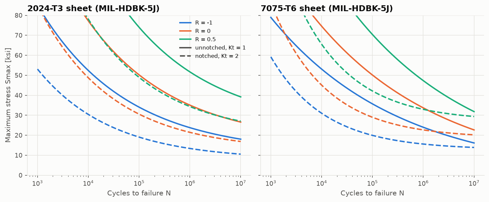
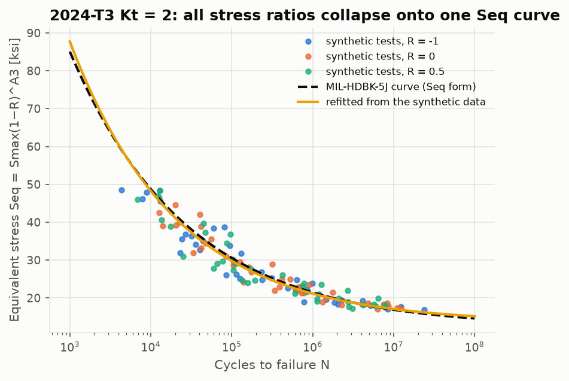
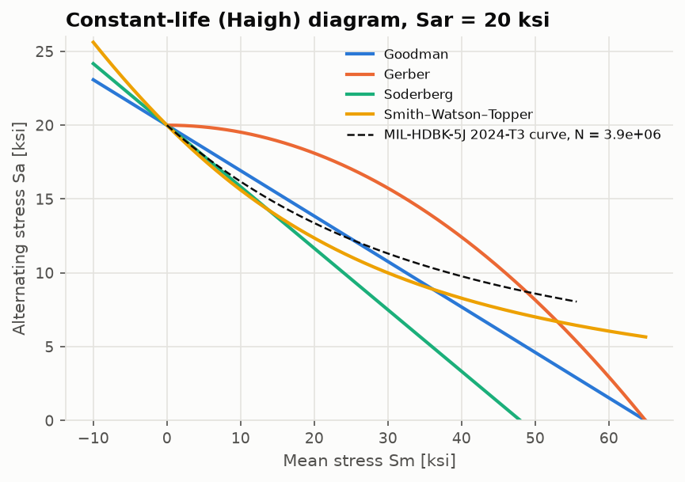
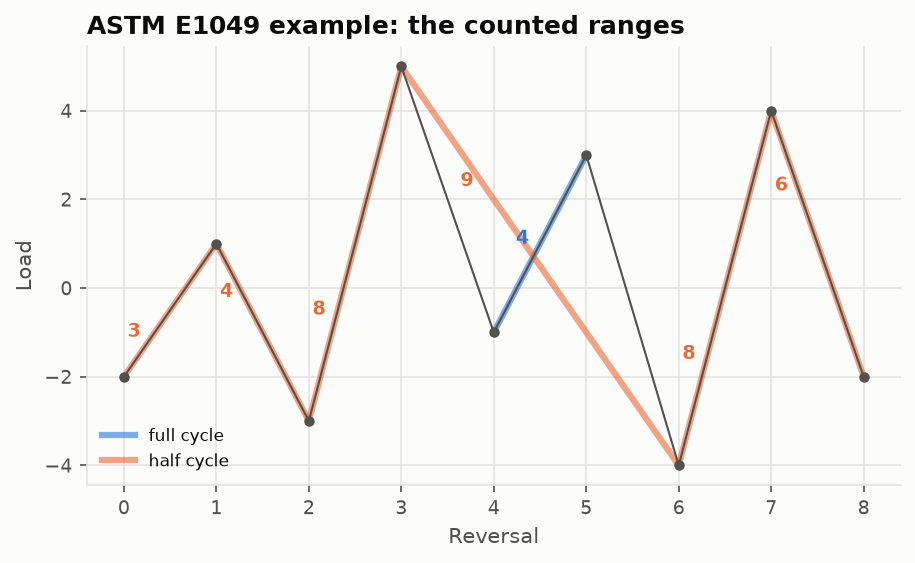
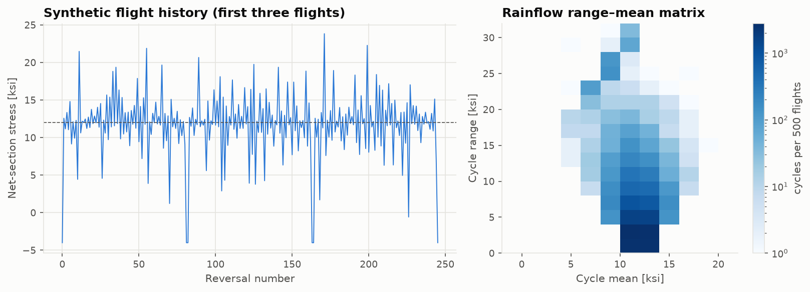
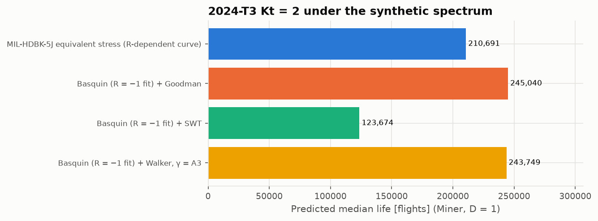

# Lesson 6 · Fatigue

> *"It carried the load a million times, then broke at a lower one."* Fatigue sets the life of
> metallic airframes: the inspection intervals, the life limits, the retirement of fleets. This
> lesson goes from an S-N curve to a predicted life under a flight spectrum.

**Code:** [`src/structures/fatigue/`](../../src/structures/fatigue) ·
**Notebook:** [`06_fatigue.ipynb`](../../notebooks/06_fatigue.ipynb) ·
**Previous:** [Lesson 5](05-composite-laminates.md) · **Next:** [Lesson 7 — Verification and validation](07-verification-and-validation.md)

## Learning objectives

1. Describe a cyclic load by its range, amplitude, mean and stress ratio R.
2. Use and fit S-N curves: Basquin, and the MIL-HDBK-5J equivalent-stress model.
3. Correct for mean stress with Goodman, Gerber, Soderberg, SWT and Walker.
4. Count cycles in an irregular history with the ASTM E1049 rainflow algorithm.
5. Predict life with Miner's rule and judge how much the answer depends on the modelling.

---

## 1. Describing a cycle

A constant-amplitude cycle between $S_{min}$ and $S_{max}$ has

```math
S_a = \frac{S_{max}-S_{min}}{2}, \qquad S_m = \frac{S_{max}+S_{min}}{2}, \qquad R = \frac{S_{min}}{S_{max}}
```

R = −1 is fully reversed, R = 0 is zero-to-tension, and R → 1 approaches static load. Tensile
mean stress shortens life: it holds cracks open.

## 2. S-N curves

Test specimens at constant amplitude, count cycles to failure, and plot stress against log N.
Over the finite-life region the data are often close to a straight line in log–log axes, the
**Basquin** law:

```math
N = C\,S^{-m} \quad\Longleftrightarrow\quad \log N = \log C - m\log S
```

`fit_basquin` regresses log N on log S. Life is the dependent variable because it is the
quantity with scatter, the convention of ASTM E739.

**MIL-HDBK-5J's equivalent-stress model** puts every stress ratio on one curve:

```math
\log_{10}N_f = A_1 + A_2\log_{10}(S_{eq} - A_4), \qquad S_{eq} = S_{max}(1-R)^{A_3}
```

$A_4$ is a fatigue limit: below it the life is infinite. Since $S_{max}(1-R) = 2S_a$,
$S_{eq} \propto S_{max}^{1-A_3}S_a^{A_3}$. That is a *Walker* mean-stress correction with the
exponent fitted to the data. For 2024-T3 sheet (Fig. 3.2.3.1.8(e)) the coefficients are
$A_1$ = 11.1, $A_2$ = −3.97, $A_3$ = 0.56, $A_4$ = 15.8 ksi.



Notching the specimen (Kt = 2) shortens life at the same net-section stress, by a factor of 33
at 30 ksi and R = 0.1. Joints, holes and fillets are where fatigue cracks start.

**Fitting the model.** `fit_equivalent_stress` recovers $A_1 \ldots A_4$ from (S_max, R, N) data
by nonlinear least squares. On synthetic data drawn from the handbook curve with the
handbook's scatter, the refit reproduces the lives within a factor of 1.5. The individual
coefficients wander, though: $A_1$, $A_2$ and $A_4$ trade off against each other. Two
published coefficient sets can look different and still describe the same curve.



## 3. Mean-stress corrections

Without the handbook's R-dependent curve, we need to convert a cycle $(S_a, S_m)$ into an
equally damaging fully reversed amplitude $S_{ar}$:

| Model | $S_{ar}$ | Character |
|---|---|---|
| Goodman | $S_a/(1 - S_m/S_u)$ | the standard choice |
| Gerber | $S_a/(1 - (S_m/S_u)^2)$ | least conservative for tensile means |
| Soderberg | $S_a/(1 - S_m/S_y)$ | most conservative |
| SWT | $\sqrt{S_{max}S_a}$ | no material constant |
| Walker | $S_{max}^{1-\gamma}S_a^{\gamma}$ | γ fitted to data; γ = 0.5 is SWT |



The constant-life diagram shows the disagreement at a glance. The dashed curve is what the
2024-T3 data imply (MIL-HDBK-5J): above 30 ksi mean, every simple model is conservative.

## 4. Rainflow counting

Flight loads are irregular, and something has to define what counts as a cycle. Rainflow
counting (ASTM E1049) pairs reversals into closed stress–strain hysteresis loops, which are
the events that cause damage:

1. Reduce the history to its peaks and valleys.
2. Push them onto a stack one at a time.
3. Whenever the newest range X is at least the previous range Y, Y is a closed loop. Count it
   as a full cycle and remove its two points. If Y includes the starting point, count it as
   half a cycle and drop the first point instead.
4. At the end, everything left on the stack is a half cycle.



The ASTM example history −2, 1, −3, 5, −1, 3, −4, 4, −2 gives ranges 3 (½), 4 (1½), 6 (½),
8 (1) and 9 (½). `count_cycles` reproduces it cycle by cycle, including the means.

## 5. Miner's rule

Each cycle uses up a fraction 1/N of the life at its own amplitude. Failure is predicted when
the fractions add to one:

```math
D = \sum_i \frac{n_i}{N_i}, \qquad \text{life} = \frac{1}{D}\ \text{blocks}
```

The rule ignores load sequence: a large overload followed by small cycles is treated like the
reverse, although real cracks are retarded after an overload. Test-calibrated critical values
of D range from about 0.3 to 3. Despite this, Miner's rule is the industry baseline because
it is simple and, with calibration, adequate.

## 6. Worked example: a synthetic flight spectrum

`flight_history` builds a lower-wing-skin-like history:
- a ground–air–ground (GAG) cycle each flight, from −4 ksi on the ground to the 12 ksi 1 g
  in-flight stress;
- 40 gust cycles per flight with exponentially distributed increments (mean 2.5 ksi).

500 flights give 20,007 rainflow cycles:



Applied to 2024-T3 at Kt = 2:



| Model | Life (flights) |
|---|---|
| MIL-HDBK-5J R-dependent curve | 210,691 |
| Basquin at R = −1 + Goodman | 245,040 |
| Basquin at R = −1 + Walker (γ = A3) | 243,749 |
| Basquin at R = −1 + SWT | 123,674 |

The same loads, material and damage rule give lives a factor of two apart, purely from the S-N
and mean-stress modelling. That is before the large scatter of fatigue itself: the
handbook's standard error of 0.27 in log life is a factor of 1.9 for one standard deviation.
Certification divides by a scatter factor (commonly 3 to 5) and backs fatigue analysis up
with crack-growth-based inspections (damage tolerance).

## 7. Common pitfalls

- **Amplitude or range?** The handbook uses $S_{max}$ and R. Basquin fits may use amplitude or
  range. A factor of 2 in stress is a factor of about 16 in life at m = 4.
- **Net or gross stress.** The notched curves use net-section stress.
- **Extrapolating S-N equations** beyond the tested lives or stress ratios. The handbook says
  this explicitly, and the 7075 curves cross beyond 10⁷ cycles.
- **Dropping small cycles.** With a fatigue limit, small cycles are harmless. With a pure
  Basquin line, they all contribute. Know which one your curve assumes.
- **Treating a median life as a safe life.**

## 8. Exercises

1. Find the median life of unnotched 2024-T3 sheet at $S_{max}$ = 30 ksi and R = 0.1. Repeat
   for Kt = 2.
2. Rainflow-count the history 0, 5, 1, 4, −2, 3, 0 by hand.
3. A block contains 10⁴ cycles at a level with N = 10⁵ and 10³ cycles at a level with N = 10⁴.
   How many blocks to failure? Does the order within the block matter to Miner?
4. For $S_a$ = 10 ksi, $S_m$ = 20 ksi and $S_u$ = 65 ksi, compute $S_{ar}$ by Goodman, SWT, and
   Walker with γ = 0.68.
5. Why does the handbook curve predict a *longer* life than Basquin + SWT for the flight
   spectrum, when both describe the same material?

<details>
<summary>Answers</summary>

1. $S_{eq}$ = 30 × 0.9^0.56 = 28.28 ksi, so log N = 11.1 − 3.97 log(12.48) = 6.748 and
   N = 5.6×10⁶. With Kt = 2 (Fig. 3.2.3.1.8(g)), N = 1.7×10⁵: 33 times shorter.
2. One full cycle of range 3 (between 1 and 4, mean 2.5), then half cycles of range 5 (0→5),
   7 (5→−2), 5 (−2→3) and 3 (3→0). Totals: range 3 ×1.5, range 5 ×1, range 7 ×½.
3. D = 0.1 + 0.1 = 0.2 per block, so 5 blocks. Miner ignores order entirely.
4. Goodman 14.44 ksi, SWT $\sqrt{30 \times 10}$ = 17.32 ksi, Walker $30^{0.32}10^{0.68}$ = 14.21 ksi.
5. Most of the cycles are small gusts around a high tensile mean. SWT penalises tensile mean
   heavily. The handbook curve has a fatigue limit ($A_4$ = 12.3 ksi equivalent), so many small
   cycles do no damage at all. The Basquin line has no limit and gives them all some damage.

</details>

## Key takeaways

- S-N curves, mean-stress corrections, cycle counting and a damage rule are four separate
  modelling choices. Each can change the predicted life by a factor of two or more.
- Rainflow counting turns an irregular history into closed hysteresis loops. ASTM E1049 is
  the reference.
- Fatigue predictions are medians with large scatter. Real aircraft rely on scatter factors
  and damage-tolerance inspections, not on Miner alone.

## Further reading

- N. E. Dowling, *Mechanical Behavior of Materials*, Chs. 9–10 and 14.
- ASTM E1049-85 (2017), *Standard Practices for Cycle Counting in Fatigue Analysis*.
- MIL-HDBK-5J, Secs. 1.4.9 and 9.3.4 (fatigue data presentation and the equivalent-stress model).
- J. Schijve, *Fatigue of Structures and Materials* (aircraft fatigue, spectra, scatter).
