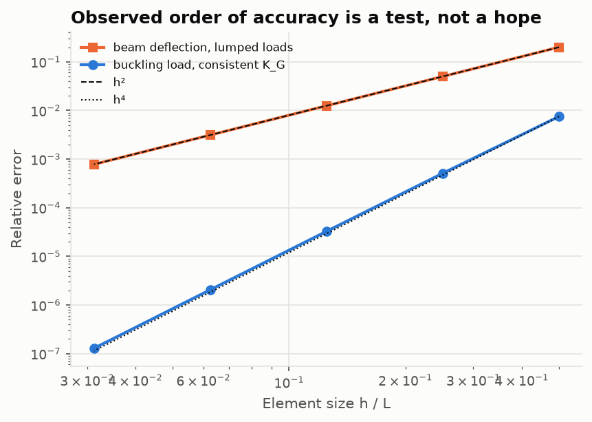

# Lesson 7 · Verification and validation

> *"How do you know it's right?"* Every number in this project went through the same process.
> This lesson explains it, with the real mistakes it caught along the way.

**Code:** [`tests/`](../../tests) · [`validation/`](../../validation) ·
**Report:** [validation report](../validation-report.md) ·
**Previous:** [Lesson 6](06-fatigue.md) · **Back to:** [course index](README.md)

## Learning objectives

1. Distinguish verification (solving the equations right) from validation (solving the right
   equations).
2. Build a hierarchy of tests, from algebraic identities to published data.
3. Use observed order of accuracy as a test.
4. Handle reference data honestly: provenance, basis, rounding and scatter.
5. Make results reproducible.

---

## 1. Two questions

- **Verification:** does the code solve its mathematical model correctly? This is answered by
  comparison with exact solutions, invariants and convergence rates.
- **Validation:** is the model adequate for the real structure? This is answered by comparison
  with test data, which here means handbook data that summarise tests.

Verification comes first. If the solver does not solve its equations, nothing can be learned
by comparing it with experiments.

## 2. A hierarchy of checks

| Level | Example in this project | What it catches |
|---|---|---|
| Algebraic identities | $\mathbf T^{\mathsf T}\mathbf T_\varepsilon = \mathbf I$; invariants under rotation; [S][C] = I | wrong transformation or sign |
| Structural properties | element K symmetric with exactly 3 rigid-body modes; B = 0 for symmetric laminates | assembly and formulation errors |
| Closed-form solutions | PL³/3EI, π²EI/(KL)², plate k = 4 | almost everything, but only for simple cases |
| Cross-code comparison | FEA vs the Macaulay solver on the same overhanging beam | errors that share no code path |
| Convergence order | lumped loads O(h²), interpolation O(h⁴), buckling O(h⁴) | subtle bugs that still give "close" answers |
| Published worked examples | Kaw's laminates, the ASTM E1049 rainflow example | definition mismatches |
| Handbook data | MIL-HDBK-5J allowables and S-N equations | wrong units, wrong basis, misapplied models |

Each level catches errors the others miss. A test suite that only compares against one
textbook number checks very little.

## 3. Order of accuracy as a test

If theory says the error falls as $h^p$, measure p. Run three or more meshes, compute
$p = \log(e_1/e_2)/\log(h_1/h_2)$, and assert it. This project asserts p = 2.00 for lumped loads
and p = 4 for buckling, to two decimals. An off-by-one in a shape function, a missing
equivalent-load term, or a wrong geometric stiffness changes the order even when one mesh
happens to give a plausible number.

Watch for two things when you do this. First, round-off eventually spoils the
convergence: the consistent-load error rises to 3×10⁻¹¹ at 64 elements. Second, a "converged"
answer can still be wrong if the *model* is wrong. Convergence verifies the discretisation,
not the physics.

## 4. The mistakes this project caught

They are listed in the order they happened. Notice how many were in the *references* rather
than the solvers. Independent checks find errors on both sides.

1. **A test with a wrong hand calculation.** The principal angle of (−20, 90, 60) MPa was
   expected at 68.74°. The code said 66.26°. The test was wrong: atan2(120, −110) is 132.51°,
   not 137.5°.
2. **Rounded handbook coefficients.** $wL^4/185EI$ and $0.00652\,w_0L^4/EI$ disagreed with the
   solver at 2×10⁻³ and 3×10⁻⁴. The exact expressions agree to 10⁻⁹.
3. **The wrong root.** The first exact propped-cantilever reference put the maximum deflection
   at $(15+\sqrt{33})L/32$, a stationary point outside the physical maximum. The solver was
   right.
4. **A sign expectation.** A counter-clockwise couple at the right end of a simply supported
   beam was expected to hog the beam. It sags it. The test was fixed, after a free-body
   diagram.
5. **A genuine solver issue: end values.** Evaluating the moment exactly at a fixed right end
   returned 0, the right-hand limit, which includes the reaction. Users expect the left-hand
   limit there. Interior points keep right-hand limits, so a load at x = a is included at a.
6. **A sway direction.** The L-frame's knee was expected to sway away from the load. It sways
   towards it. The unit-load method agrees with the FEA once the sign is done carefully.
7. **A method-of-sections slip.** The Pratt-truss reference took moments about the wrong
   joint: 45 kN against the solver's 40 kN. Redone correctly, the reference gives 40 kN.
8. **A definition mismatch.** "Tsai–Hill" returned 16.06 MPa against Kaw's 10.94. 16.06 is
   Kaw's *modified* Tsai–Hill: the original criterion uses tensile strengths only. Both
   versions now exist and both match.
9. **A wrong identity in a test.** The transformation check asserted
   $\mathbf T_\varepsilon^{\mathsf T}\mathbf T_\sigma(-\theta) = \mathbf I$, which is false. The
   correct statement, from work invariance, is $\mathbf T_\sigma^{\mathsf T}\mathbf T_\varepsilon = \mathbf I$.
10. **A reference bug found while writing the course.** The off-centre point-load closed form
    swapped a and b, so for loads left of midspan it returned the mirrored reaction. The
    original test only placed the load right of midspan. Testing both sides of a symmetry is
    cheap and worth doing.

## 5. Tolerances

A tolerance is a claim about where the error comes from. In this project:

- **Round-off checks** use pytest's default (10⁻⁶ relative) or tighter.
- **Published values** are compared at their printed precision. Kaw prints four significant
  figures, so 10⁻³ is the right tolerance.
- **Discretisation errors** get a tolerance justified by the measured convergence rate. The
  fixed–fixed buckling check uses 10⁻⁴ at 16 elements because its half-wave is the shortest,
  and a comment in the test says so.
- **Scatter.** The S-N refit is judged on predicted life within a factor of 1.5, not on
  individual coefficients, because the coefficients are not separately identifiable.

The rule in [CLAUDE.md](../../CLAUDE.md): never loosen a tolerance to make a test pass without
writing down why.

## 6. Data honesty

- **Provenance.** Every transcribed number carries its document and table, e.g.
  `[5J-3.2.3.0(b1)]`. A value that could not be checked against its source was left out.
  AS4/3501-6 was dropped because MIL-HDBK-17-2F lists no shear data for it.
- **Basis.** A- and B-basis allowables are statistical lower bounds. Typical values and means
  are not. The tangent-modulus column pairs a *typical* Ramberg–Osgood n with a B-basis yield
  stress, and the data file says so.
- **Scatter.** S-N curves are medians with a standard error of 0.27–0.41 in log life. A
  predicted life without a scatter factor is not a safe life.
- **Extrapolation.** The handbook's own caution about stress ratios and lives outside the test
  range is repeated where the curves are plotted.

## 7. Reproducibility

- `validation/run_all.py` regenerates every figure and table, and a second run is
  byte-identical. PNG metadata timestamps are removed and random spectra use fixed seeds.
- Notebooks are generated from source (`build_notebooks.py`) with stable cell ids and no
  timing metadata, so they diff cleanly.
- CI runs ruff and the full test suite on Python 3.11 and 3.12 for every push.

## 8. Exercises

1. Pick one function in `src/structures` and list one check from each level of the hierarchy
   that would apply to it.
2. A solver gives errors 1.2×10⁻², 3.1×10⁻³ and 7.7×10⁻⁴ on meshes of 4, 8 and 16 elements.
   What is the observed order? What would you suspect if theory predicted 4?
3. Which of the ten mistakes above would a test against a single textbook number have
   caught? Which needed a second, independent check?
4. Kaw prints $E_x$ = 124.5 GPa. Your code gives 124.532 GPa. Is that a pass? What tolerance
   would you write?
5. Why is "all tests pass" not the same as "the model is valid for the wing"?

Answers

1. For example, `linear_buckling`: K symmetric and positive definite after supports (structural
   property); Euler loads for four end conditions (closed form); the convergence order
   (order test); a different code or textbook FE result (cross-code); there is no handbook
   level, because MIL-HDBK-5J column test data would be a validation check.
2. p = log₂(1.2e-2/3.1e-3) ≈ 1.95, then log₂(3.1e-3/7.7e-4) ≈ 2.01, so p ≈ 2. If theory says 4,
   suspect lumped rather than consistent terms: a missing moment term, or an inconsistent
   geometric stiffness.
3. A single comparison would catch 2, 3, 5, 7 and 8, since each produced a clear numerical
   mismatch. Number 10 needed a second test case on the other side of the symmetry. 1, 4, 6 and
   9 were errors *in the tests*. They were caught because solver and test disagreed and the
   disagreement was investigated rather than "fixed".
4. Yes: 124.532 rounds to 124.5, and the relative difference is 2.6×10⁻⁴. Use rel = 10⁻³ (half
   a unit in the fourth significant figure is 4×10⁻⁴).
5. Tests verify the code against its models. Validity for a wing also needs the models'
   assumptions to hold there (linearity, no buckling of the skin, Euler–Bernoulli kinematics,
   Miner's rule) and the inputs to be right (loads, allowables, environment). Only comparison
   with representative tests establishes that.

## Key takeaways

- Verify before you validate. Use many independent kinds of check, not many checks of one
  kind.
- Measure the order of accuracy. It is the most sensitive verification test available.
- When code and reference disagree, either one may be wrong. Here the reference or the test
  was wrong more often than the solver.
- Cite every number, state its basis, and make every figure reproducible.

## Further reading

- W. L. Oberkampf & C. J. Roy, *Verification and Validation in Scientific Computing*.
- P. J. Roache, *Verification and Validation in Computational Science and Engineering*.
- ASME V&V 10, *Guide for Verification and Validation in Computational Solid Mechanics*.
