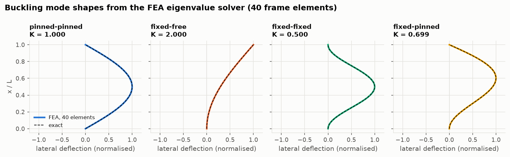
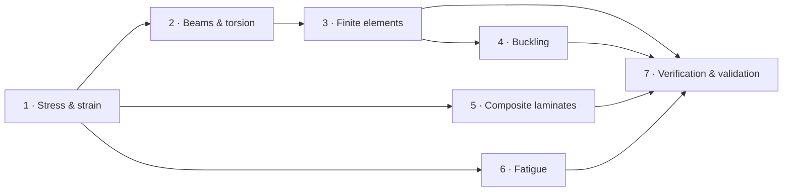

# Aircraft structures from scratch: the course

Seven lessons build a working structural-analysis toolkit from first principles. Each one
derives the theory, turns it into the code in this repository, checks it against exact,
published or handbook results, and ends with exercises (answers included).



## Lessons

| # | Lesson | You will learn | Key result |
|---|---|---|---|
| 1 | [Stress and strain](01-stress-and-strain.md) | stress transformation, Mohr's circle, von Mises and Tresca, Hooke's law | yield margin against a MIL-HDBK-5J allowable |
| 2 | [Beams and torsion](02-beams-and-torsion.md) | Euler–Bernoulli beams, Macaulay functions, thin-walled sections, Bredt–Batho | one linear system for determinate and indeterminate beams; open sections 7500× weaker in torsion |
| 3 | [The finite element method](03-finite-element-method.md) | shape functions, element matrices, assembly, supports, consistent loads | exact nodal deflections; convergence orders 2 and 4 |
| 4 | [Buckling](04-buckling.md) | Euler, Johnson and tangent-modulus columns, plate buckling, eigenvalue FEA | FEA buckling loads within 3e-5 of Euler |
| 5 | [Composite laminates](05-composite-laminates.md) | ply stiffness, ABD matrix, ply stresses, failure criteria, ply-by-ply failure | Kaw's worked examples to four significant figures |
| 6 | [Fatigue](06-fatigue.md) | S-N curves, mean stress, rainflow counting, Miner's rule | a factor-of-two spread in life from modelling choices alone |
| 7 | [Verification and validation](07-verification-and-validation.md) | test hierarchies, order of accuracy, data honesty, reproducibility | the ten mistakes this project caught, and how |



Lessons 1 → 2 → 3 → 4 follow the metallic-structure path. Lesson 5 (composites) and Lesson 6
(fatigue) need only Lesson 1. Lesson 7 ties everything together and can be read at any point.

## Prerequisites

- Mechanics of materials: stress, strain, Hooke's law, free-body diagrams.
- Linear algebra: matrices, eigenvalues, solving $A\mathbf x = \mathbf b$.
- Basic differential equations (beam bending).
- Enough Python/NumPy to read a 50-line function.

## How to use it

1. **Read the lesson.** Every formula is derived. Skip the derivations on a first pass if you like.
2. **Run the matching notebook** in [`notebooks/`](../../notebooks) and change the inputs.
3. **Open the code** linked at the top of each lesson. It is short and mirrors the equations.
4. **Do the exercises** before opening the answers.

```bash
uv sync
uv run --with jupyterlab jupyter lab notebooks/
```

JupyterLab is not a project dependency. `--with` pulls it in for that command only.

## Figures

The teaching figures in [`docs/figures/lessons/`](../figures/lessons) are generated by
[`make_figures.py`](make_figures.py). The others are validation figures from
[`validation/`](../../validation).

```bash
uv run python docs/lessons/make_figures.py
```

## Reference texts

- T. H. G. Megson, *Aircraft Structures for Engineering Students*: the main companion for
  Lessons 1, 2 and 4.
- J. M. Gere & B. J. Goodno, *Mechanics of Materials*: Lessons 1 and 2.
- R. D. Cook et al., *Concepts and Applications of Finite Element Analysis*: Lessons 3 and 4.
- S. P. Timoshenko & J. M. Gere, *Theory of Elastic Stability*: Lesson 4.
- A. K. Kaw, *Mechanics of Composite Materials*: Lesson 5.
- N. E. Dowling, *Mechanical Behavior of Materials*, and J. Schijve, *Fatigue of Structures
  and Materials*: Lesson 6.
- MIL-HDBK-5J and MIL-HDBK-17-2F: the data behind all of them.
