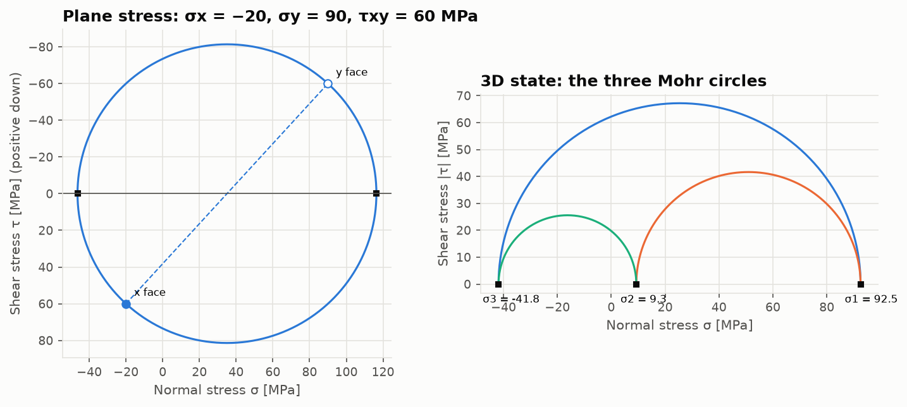
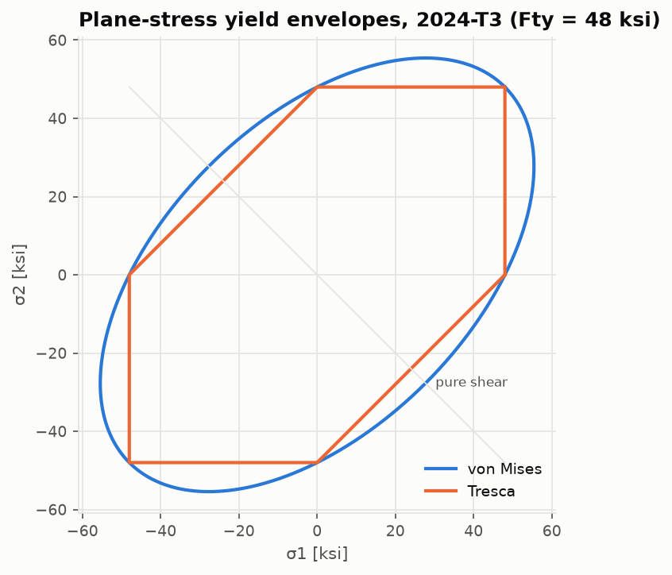

# Stress and strain at a point

Code: [`src/structures/stress_strain/`](../src/structures/stress_strain) ·
Notebook: [`01_stress_strain.ipynb`](../notebooks/01_stress_strain.ipynb)

## State of stress

The Cauchy stress tensor is symmetric, so six components describe the state at a point. The
code uses Voigt order: $[\sigma_x, \sigma_y, \sigma_z, \tau_{yz}, \tau_{xz}, \tau_{xy}]$ in 3D
and $[\sigma_x, \sigma_y, \tau_{xy}]$ for plane stress. Tension is positive.

```math
\boldsymbol\sigma = \begin{bmatrix} \sigma_x & \tau_{xy} & \tau_{xz} \\ \tau_{xy} & \sigma_y & \tau_{yz} \\ \tau_{xz} & \tau_{yz} & \sigma_z \end{bmatrix},
\qquad \boldsymbol\sigma' = \mathbf R\,\boldsymbol\sigma\,\mathbf R^{\mathsf T}
```

where the rows of $\mathbf R$ are the new axes. For a rotation $\theta$ about z, counter-clockwise
positive, the plane-stress transformation is

```math
\begin{aligned}
\sigma_{x'} &= \frac{\sigma_x+\sigma_y}{2} + \frac{\sigma_x-\sigma_y}{2}\cos 2\theta + \tau_{xy}\sin 2\theta \\
\sigma_{y'} &= \frac{\sigma_x+\sigma_y}{2} - \frac{\sigma_x-\sigma_y}{2}\cos 2\theta - \tau_{xy}\sin 2\theta \\
\tau_{x'y'} &= -\frac{\sigma_x-\sigma_y}{2}\sin 2\theta + \tau_{xy}\cos 2\theta
\end{aligned}
```

Strains transform the same way if you use the tensor shear strain $\varepsilon_{xy} = \gamma_{xy}/2$.
`transform_strain_2d` takes and returns engineering shear strain.

## Principal stresses and Mohr's circle

Setting $\tau_{x'y'} = 0$ gives the principal directions and stresses:

```math
\tan 2\theta_p = \frac{2\tau_{xy}}{\sigma_x-\sigma_y}, \qquad
\sigma_{1,2} = \frac{\sigma_x+\sigma_y}{2} \pm \sqrt{\left(\frac{\sigma_x-\sigma_y}{2}\right)^2 + \tau_{xy}^2}
```

The square root is the radius of Mohr's circle and the maximum in-plane shear stress. It acts
45° from the principal planes. In 3D the principal stresses are the eigenvalues of
$\boldsymbol\sigma$ (`principal_3d` uses `numpy.linalg.eigh`), and the three Mohr circles have
diameters $\sigma_1-\sigma_2$, $\sigma_2-\sigma_3$ and $\sigma_1-\sigma_3$. The invariants

```math
I_1 = \operatorname{tr}\boldsymbol\sigma, \qquad I_2 = \tfrac12\left[(\operatorname{tr}\boldsymbol\sigma)^2 - \operatorname{tr}(\boldsymbol\sigma^2)\right], \qquad I_3 = \det\boldsymbol\sigma
```

do not depend on the axes. The tests use them to check the transformation.



## Yield criteria

For ductile metals:

```math
\sigma_{vM} = \sqrt{\tfrac12\left[(\sigma_1-\sigma_2)^2 + (\sigma_2-\sigma_3)^2 + (\sigma_3-\sigma_1)^2\right]}
= \sqrt{\sigma_x^2+\sigma_y^2+\sigma_z^2-\sigma_x\sigma_y-\sigma_y\sigma_z-\sigma_z\sigma_x+3(\tau_{xy}^2+\tau_{yz}^2+\tau_{xz}^2)}
```

```math
\sigma_{Tresca} = \sigma_1 - \sigma_3
```

Tresca must include the out-of-plane principal stress, which is zero in plane stress. For an
equibiaxial state $\sigma_1 = \sigma_2 = \sigma$ it gives $\sigma$, not 0. Von Mises never exceeds
Tresca, and Tresca is at most $2/\sqrt3$ times von Mises (pure shear).
`safety_factor(s, Fy)` returns $F_y/\sigma_{eq}$.



## Hooke's law

For an isotropic solid, `compliance_matrix(E, nu)` gives the 6×6 $[S]$ with
$\boldsymbol\varepsilon = [S]\boldsymbol\sigma$, and `stiffness_matrix` gives $[C] = [S]^{-1}$ in
Lamé form ($\lambda = E\nu/[(1+\nu)(1-2\nu)]$, $G = E/[2(1+\nu)]$). The plane-stress and
plane-strain 3×3 matrices are reductions of these: invert the in-plane block of $[S]$ for plane
stress, take the in-plane block of $[C]$ for plane strain. The tests check both reductions.

## Materials

`structures.materials.isotropic("2024-T3", "B")` returns MIL-HDBK-5J allowables in SI units:
Ftu, Fty, Fcy, Fsu, E, Ec, G, ν and density, each with its table number. See
[`data/mil_hdbk_5j.csv`](../src/structures/materials/data/mil_hdbk_5j.csv).

## Validation

| Check | Result | Source |
|---|---|---|
| Transformation = $\mathbf R\boldsymbol\sigma\mathbf R^{\mathsf T}$; invariants under random rotations | round-off | tensor algebra |
| Pure shear τ | ±τ at 45° | closed form |
| (−20, 90, 60) MPa | σ = 116.39 / −46.39 MPa, θp = 66.26° | closed form |
| von Mises: uniaxial, pure shear, hydrostatic | σ, √3 τ, 0 | closed form |
| Plane-stress and plane-strain [D] from the 3D law | exact | reduction |

See [`validation/results/stress_strain.md`](../validation/results/stress_strain.md).

## Limits

Linear elasticity, small strains, isotropic material. Yield criteria assume ductile,
pressure-insensitive behaviour. Plasticity beyond first yield is only touched on, through the
Ramberg–Osgood tangent modulus in the buckling module.
