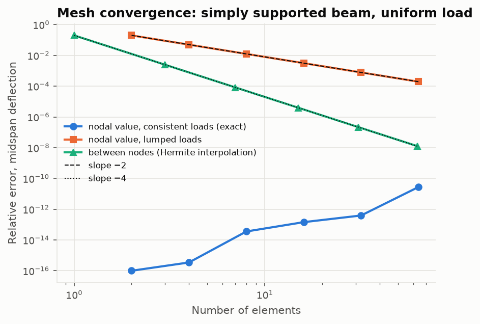

# Validation report

Every module in this repository is checked against a closed-form result, a published worked
example, or cited handbook data. The scripts in [`validation/`](../validation)
(`uv run python validation/run_all.py`) produce all the numbers below. They also write the
figures in [`docs/figures/`](figures) and the raw tables in
[`validation/results/`](../validation/results). The same checks run as `pytest` on every push.

Data sources, all free and public:
- **MIL-HDBK-5J** (2003, Distribution A): metallic allowables, Ramberg–Osgood exponents and
  S-N equations.
- **MIL-HDBK-17-2F** (2002, Distribution A): T300/976 ply properties.
- **Kaw, *Mechanics of Composite Materials*** worked examples, as reproduced in the author's
  open courseware.
- **ASTM E1049**: the rainflow example.

Every transcribed value carries its table or figure number in the CSV that holds it.

## Scorecard

| Module | Benchmark | Computed | Reference | Status |
|---|---|---|---|---|
| Stress/strain | Principal stresses of (−20, 90, 60) MPa | 116.39 / −46.39 MPa | closed form | exact |
| Stress/strain | Invariants under random rotations | 4.5e-16 change | 0 | round-off |
| Beams | 9 standard cases (determinate and indeterminate) | max error 2e-9 | closed forms | ✔ |
| Torsion | Thin tube, Bredt–Batho vs exact annulus J | −1.0e-4 | thin-wall approximation | ✔ |
| FEA | Trusses, beams, L-frame, Macaulay cross-check | ≤ 2e-14 | hand / closed form | exact |
| FEA | Convergence order: lumped loads / interpolation | 2.00 / 4.00 | 2 / 4 | ✔ |
| Buckling | FEA vs Euler, 4 end conditions, 16 elements | ≤ 3.3e-5 | π²EI/(KL)² | ✔ |
| Buckling | Plate k at a/b = 1, 2, 3 and √2 | 4, 4, 4, 4.5 | Timoshenko & Gere | exact |
| Laminates | Kaw [0/90/0]: A, D, Ex, Ey, νxy, flexural moduli | ≤ 4.8e-4 | Kaw (4 s.f.) | ✔ |
| Laminates | Kaw 60° lamina: 5 failure criteria | ≤ 2.3e-4 | Kaw (4 s.f.) | ✔ |
| Laminates | Kaw [0/90/0] ply-by-ply failure | 7.277e6, 1.5e7 N/m | 7.277e6, 1.5e7 N/m | ✔ |
| Fatigue | ASTM E1049 rainflow example | cycle by cycle | ASTM E1049 | exact |
| Fatigue | Refit of handbook curve from scattered data | lives within ×1.5 | MIL-HDBK-5J Fig. 3.2.3.1.8(g) | ✔ |

## 1. Stress and strain

The closed-form plane transformation equals $\mathbf R\boldsymbol\sigma\mathbf R^{\mathsf T}$. The
three invariants survive random 3D rotations to 4.5e-16. Principal stresses, the 45° offset
of maximum shear, and the special cases of von Mises and Tresca are exact. The
plane-stress and plane-strain stiffness matrices are recovered from the 3D Hooke's law: the
first by inverting the in-plane block of [S], the second by taking the in-plane block of [C].
Details: [`stress_strain.md`](../validation/results/stress_strain.md).

## 2. Beams and torsion

The Macaulay solver matches nine closed-form cases to round-off. Four of them are statically
indeterminate: the propped cantilever, the fixed–fixed beam under uniform and point load, and
the two-span continuous beam.

**Two discrepancies found along the way, both in the references.** The textbook
coefficients 0.00652 (triangular load) and 1/185 (propped cantilever) are rounded and
disagree with the solver at 3e-4 and 2e-3. The exact expressions, now in `closed_form.py`,
agree to 1e-9. The first version also put the propped-cantilever maximum at the wrong root
of the slope equation, $(15+\sqrt{33})L/32$ instead of $(15-\sqrt{33})L/16$, and the test
caught it.

Bredt–Batho matches the exact annulus J of a thin tube to 1e-4, the thin-wall
approximation error for t/r = 0.02. Details: [`beam_theory.md`](../validation/results/beam_theory.md).

## 3. Finite element solver

All truss and frame benchmarks agree to machine precision:
- truss hand solutions, including a statically indeterminate three-bar truss
- the closed-form beams
- an overhanging beam with mixed loads, cross-checked against the independent Macaulay solver
- an L-frame whose tip deflection includes axial shortening
- a 6-panel Pratt truss checked by the method of sections

**Convergence.** With consistent loads, nodal displacements are exact on every mesh (Tong's
theorem). The largest error is 2.8e-11, from conditioning at n = 64. Lumped loads converge at
order 2.00, and Hermite interpolation between the nodes at order 4.00.

**A reference error, not a solver error.** The first hand calculation of the Pratt-truss
bottom chord took moments about the wrong top joint and gave 45 kN against the solver's
40 kN. Redoing the method of sections about the joint where the other cut members meet gives
40 kN. Details: [`fea_solver.md`](../validation/results/fea_solver.md),
[`fea_convergence.md`](../validation/results/fea_convergence.md).

## 4. Buckling

| End condition | K | 4 el. | 8 el. | 16 el. |
|---|---|---|---|---|
| pinned–pinned | 1.0000 | +5.1e-4 | +3.3e-5 | +2.1e-6 |
| fixed–free | 2.0000 | +3.3e-5 | +2.1e-6 | +1.3e-7 |
| fixed–fixed | 0.5000 | +7.5e-3 | +5.1e-4 | +3.3e-5 |
| fixed–pinned | 0.6992 | +2.1e-3 | +1.4e-4 | +8.6e-6 |

The errors are all positive: the consistent geometric stiffness gives an upper bound. They
fall by 16 per mesh doubling ($h^4$). Fixed–fixed is the least resolved, because its buckled
half-wave is only L/2; this is why the 16-element test tolerance is 1e-4 rather than 1e-5.

The nodal mode shapes of the three trigonometric modes are exact on uniform meshes. The
fixed–pinned mode converges at about $h^6$ (2e-5 at 4 elements, 3e-7 at 8).

The Johnson parabola meets Euler tangentially at $F_{cy}/2$. That happens at L'/ρ = 72.7 for
2024-T3 and 54.0 for 7075-T6 with MIL-HDBK-5J B-basis $F_{cy}$ and $E_c$. The tangent-modulus
curve uses the handbook's Ramberg–Osgood n = 15, which comes from a typical curve. Pairing a
typical n with a B-basis yield stress is an approximation, flagged in the data file. Details:
[`buckling.md`](../validation/results/buckling.md).

## 5. Composite laminates

Kaw prints four significant figures, and every comparison agrees to within that rounding
(≤ 4.8e-4). The checks are: [Q]; the [0/90/0] A, D and engineering constants (in-plane and
flexural); the ply stresses per N/m; the 60° lamina strengths by five criteria; and the
ply-by-ply failure sequence.

**One discrepancy found along the way, in the criterion definition.** The first Tsai–Hill
implementation picked tensile or compressive strengths by the sign of the stress. It returned
16.06 MPa against Kaw's 10.94 MPa. 16.06 is exactly Kaw's *modified* Tsai–Hill value: the
original criterion uses tensile strengths only. Both are now implemented and both match.

The analytic checks pass as well: isotropic stacks reproduce plate theory, B = 0 for
symmetric layups, quasi-isotropic A follows the invariants, and the in-plane stiffness is
invariant under rotation. Details:
[`composite_laminates.md`](../validation/results/composite_laminates.md).

## 6. Fatigue

The rainflow counter reproduces the ASTM E1049 example cycle by cycle: ranges, means, counts
and start/end indices. On random histories, every range between successive reversals is
counted exactly once.

**Refitting the handbook curve.** 120 synthetic tests were drawn from MIL-HDBK-5J Fig.
3.2.3.1.8(g) (2024-T3, Kt = 2) at R = −1, 0 and 0.5, with the handbook's own scatter
(standard error 0.27 in log life). The refit recovers A3 (0.680 vs 0.68) and the scatter
(0.252 vs 0.270), and predicts lives within a factor of 1.5 over 10⁴–10⁶ cycles. A1, A2 and A4
come back as 8.68, −3.04 and 13.5 against 9.2, −3.33 and 12.3. They are strongly correlated,
so the curve is identifiable but the individual coefficients are not. That is worth knowing
before comparing published coefficient sets.

**Spectrum study.** The synthetic flight history has 20,007 rainflow cycles per 500 flights.
Its predicted life depends on the model: 2.1 × 10⁵ flights with the handbook's R-dependent
curve, 2.4 × 10⁵ with Basquin plus Goodman or Walker, and 1.2 × 10⁵ with Basquin plus SWT.
The spread comes entirely from the S-N and mean-stress modelling, before any scatter factor.
Details: [`fatigue.md`](../validation/results/fatigue.md),
[`fatigue_spectrum.md`](../validation/results/fatigue_spectrum.md).

## What is not validated

- Plasticity beyond the tangent-modulus column, shear deformation, and geometric
  nonlinearity.
- Interlaminar stresses and progressive damage in laminates beyond full ply discount.
- Crack growth, load-sequence effects and scatter factors in fatigue.
- Any comparison with physical test data beyond what the handbooks' fitted curves summarise.
